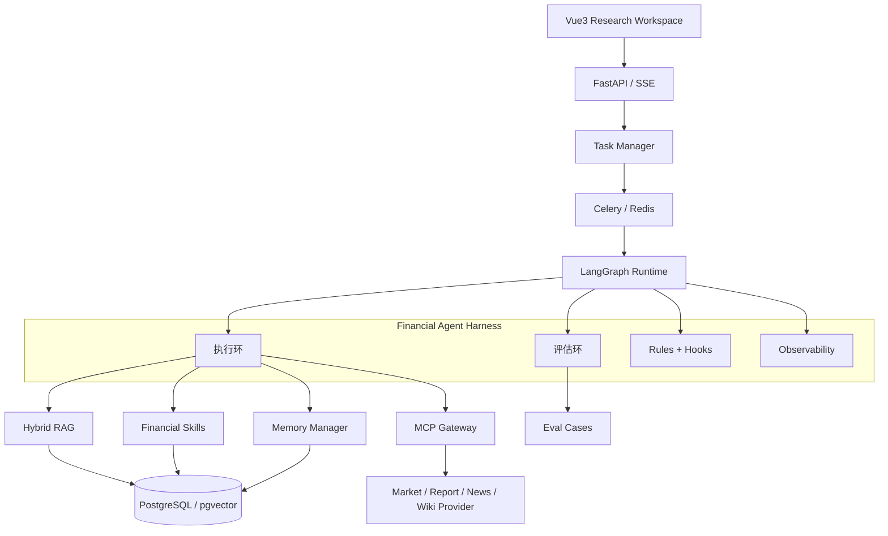

# 金融 RAG 知识库与多 Agent 投研分析平台规格书

> 项目定位：面向股票基本面研究的 Financial Agent Harness。
> 核心目标：不是生成一次性分析报告，而是构建可观测、可评估、可纠错、可长期复盘的金融 Agent 工程系统。
> 合规边界：仅做公开信息整理、研究辅助和个人复盘，不接交易接口，不输出买卖建议、目标价或收益承诺。

## 1. 项目背景

金融 Agent 在长任务中容易出现以下问题：

- 财报、公告、新闻、行情和个人笔记上下文庞大，模型输入持续膨胀；
- 工具选择错误、参数缺失、Schema 不匹配或 JSON 非法导致任务中断；
- 关键证据遗漏，报告引用覆盖不足，结论和来源无法逐条追溯；
- 长任务多轮执行后出现结论漂移、旧数据覆盖新数据和幻觉事实；
- 失败任务无法复现，只停留在日志层，不能沉淀为回归测试资产。

本项目将投研 Agent 抽象为一套 Harness：执行环负责完成任务，评估环负责检查质量并形成回归样例，使系统能够随着 Prompt、RAG、Skill、工具 Schema 和路由策略迭代而持续改进。

## 2. 技术栈

| 模块 | 技术 |
| --- | --- |
| Agent 编排 | LangGraph、Agent Loop、结构化 State |
| RAG | SQL + BM25 + pgvector、元数据过滤、证据重排、上下文压缩 |
| Eval Harness | Eval Case、质量指标、失败归因、回归测试 |
| Tooling | MCP、Skill、Schema 校验、重试降级、错误回传 |
| 后端 | Python 3.12、FastAPI、SQLAlchemy、Pydantic、Celery |
| 数据 | PostgreSQL、pgvector、Redis |
| 前端 | Vue3、TypeScript、Pinia、ECharts |
| 部署 | Docker Compose、Alembic |

## 3. 产品边界

### 3.1 支持的能力

- 输入股票代码后查看行情、估值、财务指标、三张表、公告和新闻摘要。
- 创建基本面研究任务，按节点执行数据检查、检索、分析、报告、校验和写回。
- 按公司、行业、指标、公告事件、新闻热点、风险因素和研究结论组织知识库。
- 通过 Skills 执行确定性财务计算，通过 MCP 封装行情、财报、新闻和 Wiki 能力。
- 将任务轨迹、工具调用、证据账本、Token 消耗、评估结果和失败原因可视化。
- 将通过校验的结论、风险和跟踪指标写入长期记忆与 Wiki。
- 将失败任务沉淀为 Eval Case，并在策略变更后做回归测试。

### 3.2 明确不做

- 不接券商交易、下单或自动调仓接口。
- 不输出“买入、卖出、强烈推荐、目标价、保证收益”等投资建议。
- 不允许 Agent 任意执行 Shell、SQL、网络请求或文件访问。
- 不将模型输出直接写入主数据表；事实写入必须经过校验和审计。

## 4. 总体架构



控制平面负责任务状态、租约、预算、权限、重试和可观测性；执行平面负责每个 Agent 节点的输入输出、工具调用和结果生成。LangGraph 负责单次编排，数据库负责长期状态、恢复和复盘。

## 5. Agent Harness 双环设计

### 5.1 执行环

执行环覆盖一次完整金融研究任务：

```text
任务创建
  -> 主控规划
  -> 上下文与记忆加载
  -> 数据新鲜度检查
  -> RAG 检索与证据压缩
  -> MCP / Skill 调用
  -> 财务、公告、新闻、风险多 Agent 分析
  -> 报告生成
  -> 事实校验
  -> Wiki / Memory 写回
```

### 5.2 评估环

评估环对执行结果进行质量检查：

| 指标 | 含义 |
| --- | --- |
| `data_accuracy` | 报告中的财务数字是否与数据库或证据一致 |
| `retrieval_hit_rate` | 检索是否命中正确财报、公告、新闻或 Wiki |
| `citation_coverage` | 关键结论和关键数字是否具备有效引用 |
| `hallucination_rate` | 无来源事实、错误报告期、目标价等问题比例 |
| `tool_success_rate` | MCP / Skill 调用成功率 |
| `task_completion_rate` | 长任务是否完整执行到发布或复核状态 |
| `completeness` | 报告是否覆盖指定研究维度 |

失败任务会被转换为 Eval Case：

```text
失败样例 -> 归因分析 -> Prompt / RAG / Skill / Schema / 路由修复 -> 回归评估
```

## 6. 多 Agent 协作

| Agent | 职责 | 主要输出 |
| --- | --- | --- |
| 主控 Agent | 拆解任务、选择节点、控制预算和质量门禁 | `master_plan` |
| 财务分析 Agent | 分析营收、利润、现金流、资产负债、估值和同行比较 | `financial_findings` |
| 公告事件 Agent | 提取公告事件、财报变化、重大事项和时点 | `announcement_events` |
| 新闻归因 Agent | 聚类新闻和板块热点，区分事实、推断和市场表现 | `news_attribution` |
| 风险识别 Agent | 识别财务、经营、治理、行业和合规风险 | `risk_register` |
| 报告生成 Agent | 基于结构化 Claim、证据和校验结果渲染报告 | `research_report` |

每个节点都必须记录：

- 输入和输出摘要；
- 关联证据、来源、报告期和数据截止时间；
- 工具调用参数、返回、耗时、失败原因和重试次数；
- 输入 / 输出 Token、模型 profile 和 prompt 版本；
- 节点状态、warnings 和下一步建议。

## 7. 金融 RAG 与实体标签

### 7.1 实体体系

| 实体 | 示例字段 |
| --- | --- |
| 公司 | 股票代码、名称、行业、交易所、上市日期 |
| 行业 | 行业名称、上下游、景气指标、可比公司 |
| 指标 | 指标名、口径、单位、报告期、来源 |
| 公告事件 | 事件类型、发布时间、影响对象、原文链接 |
| 新闻热点 | 新闻标题、来源、时间、实体、情绪、事件簇 |
| 风险因素 | 风险类型、严重度、触发证据、跟踪指标 |
| 研究结论 | 结论内容、置信度、证据、有效期、版本 |

### 7.2 检索策略

```text
精确财务数字 -> PostgreSQL 查询 + Skill 计算
财报 / 公告原文 -> BM25 + pgvector + metadata filter
新闻热点归因 -> 新闻检索 + 事件聚类 + 时间窗口过滤
历史研究结论 -> Wiki / Memory 检索
综合报告生成 -> SQL + RAG + Skill + Memory
```

每条检索结果必须保留 `source_type`、`source_id`、`source_url`、`publish_time`、`as_of`、`ts_code`、`metric_name`、`event_type`、`report_period`、`retrieval_score` 和 `quality_score`。

## 8. Reflection Memory

### 8.1 记忆分层

```text
short_term_memory
  当前任务目标、约束、节点产物、待解决问题

long_term_memory
  公司历史结论、核心假设、风险清单、跟踪指标

reflection_memory
  工具选错、指标口径错误、新闻归因偏差、引用缺失、幻觉案例
```

### 8.2 写入规则

- 短期记忆随任务生命周期存在，结束后转为 artifact 或摘要。
- 长期记忆写入前必须带证据、报告期、置信度和有效期。
- 反思记忆来自失败任务、人工驳回、Eval Case 和工具异常归因。
- 新任务启动时，系统按股票、行业、任务类型和失败类型注入相关反思提醒。

## 9. Token 审计与上下文压缩

### 9.1 Token 审计

按以下维度记录 Token 与成本：

- task：端到端输入 / 输出 Token、总耗时、模型调用次数；
- node：节点输入 / 输出 Token、压缩前后比例、重试次数；
- model_call：prompt 版本、模型、temperature、输入 / 输出 Token、错误类型；
- tool_call：参数摘要、输出大小、是否进入上下文。

### 9.2 上下文分层

```text
recent_raw       # 最近原文或最新财务数据
rolling_summary  # 前序节点滚动摘要
key_evidence     # 高质量证据和引用
long_memory      # 已确认长期记忆
reflection_hints # 同类失败提醒
tool_results     # 工具结果摘要和 artifact 引用
```

上下文构建器根据节点目标、证据质量和 Token 预算选择输入，不把完整财报、全部检索片段和所有历史报告直接塞给模型。

## 10. MCP / Skill 纠错机制

### 10.1 Skill

适合封装确定性或强约束金融计算：

- `valuation_range_analysis`
- `three_statement_analysis`
- `dupont_analysis`
- `cashflow_quality_analysis`
- `business_segment_analysis`
- `peer_comparison_analysis`
- `risk_red_flags_analysis`
- `investment_thesis_check`
- `sector_heat_reasoning`
- `evidence_coverage_check`

### 10.2 MCP

适合封装外部或跨服务能力：

- `market-data-mcp`：行情、估值、市值、指数；
- `financial-report-mcp`：财报、公告、解析、表格抽取；
- `news-sector-mcp`：公司新闻、板块新闻、事件聚类；
- `wiki-memory-mcp`：Wiki 检索、记忆读取、受控写回。

### 10.3 纠错流程

```text
工具选择 -> Schema 校验 -> 参数规范化 -> 调用执行
  -> 成功：记录结果和证据
  -> 失败：错误分类 -> 原因回传 -> 重新规划 / 降级调用 / 重试
  -> 重试耗尽：标记节点失败并生成 Eval Case
```

错误类型包括 `invalid_tool`、`missing_argument`、`invalid_json`、`schema_mismatch`、`timeout`、`provider_error`、`permission_denied` 和 `empty_result`。

## 11. Rules + Hooks 风险控制

| Hook | 触发点 | 检查内容 |
| --- | --- | --- |
| 证据检查 Hook | 报告生成前 | 关键 Claim 是否绑定证据 |
| 数据口径 Hook | 财务分析前 | 单季 / 累计、币种、单位、报告期是否一致 |
| 工具参数 Hook | MCP / Skill 调用前 | 必填字段、字段类型、权限和预算 |
| 事实校验 Hook | 报告发布前 | 数字回查、引用覆盖、旧数据覆盖新数据 |
| 合规 Hook | 报告发布前 | 买卖建议、目标价、收益承诺、免责声明 |

Hook 可以阻断发布、触发补检索、要求重写，或将任务标记为“需人工复核”。

## 12. 数据模型概览

核心表按职责分组：

| 分组 | 表 |
| --- | --- |
| 金融主数据 | `stock_basic`、`stock_price_daily`、`stock_valuation_daily`、`financial_*` |
| 文档与 RAG | `company_report`、`report_chunk`、`wiki_page`、`wiki_chunk` |
| Agent 任务 | `agent_task`、`agent_step`、`tool_call_log` |
| 报告与证据 | `analysis_report`、`analysis_evidence` |
| 记忆 | `agent_memory`、后续扩展 `memory_proposal` |
| 评估 | `eval_case`、`eval_result` |

后续稳定版建议扩展：

- `agent_checkpoint`：节点级状态恢复；
- `model_call_log`：模型调用、Token、成本和错误；
- `retrieval_run`：检索查询、过滤器、召回和重排轨迹；
- `evidence_item` / `evidence_pack`：不可变证据集合；
- `claim` / `claim_evidence`：结构化结论与证据绑定；
- `eval_run` / `eval_item`：一次评测和逐项评分明细。

## 13. 前端看板

| 页面 | 展示内容 |
| --- | --- |
| Mission Control | 任务状态、节点图、工具日志、证据账本、记忆写回 |
| 个股研究 | 行情、估值、财务趋势、三张表、Agent 解读 |
| 基本面分析 | 报告正文、引用证据、风险清单、跟踪计划 |
| Skills / MCP | 工具清单、调用成功率、Schema、错误分布 |
| Wiki / Memory | 公司 Wiki、行业 Wiki、指标 Wiki、长期记忆、反思记忆 |
| Eval Dashboard | Eval Case、通过率、失败原因、回归趋势、质量指标 |

## 14. 快速启动

```bash
cp .env.example .env
docker compose up -d --build
docker compose exec backend alembic upgrade head
docker compose exec backend python -m app.seed.seed_demo_data
```

访问：

```text
前端：http://localhost:5173
后端：http://localhost:8000/docs
健康检查：http://localhost:8000/health
```

测试：

```bash
docker compose exec backend pytest -q
docker compose exec frontend npm run build
```

## 15. 路线图

### Phase 1：可运行闭环

- 跑通 mock 数据、FastAPI、Vue3、Celery、LangGraph、Skill、MCP 和 Eval。
- 保证任务有 step、tool call、evidence、report、eval result。
- README 能指导面试官本地启动。

### Phase 2：Agent Runtime 强化

- 增加 checkpoint、租约、幂等、取消、恢复和错误分型。
- 扩展 model call、retrieval run 和 Token 审计。
- SSE 支持断线续传和事件顺序保证。

### Phase 3：RAG 与证据工程

- 引入 pgvector、RRF、metadata filter、rerank 和 Evidence Pack。
- Claim-first 生成报告，关键数字 100% 可回查。
- 建立财报 / 公告解析质量评分和版本化索引。

### Phase 4：Reflection Memory

- 增加 Memory Proposal、去重、冲突检测、过期和置信度衰减。
- 将失败任务和人工驳回沉淀为反思记忆。
- 新任务启动时自动注入同类错误提醒。

### Phase 5：Eval Harness 与发布门禁

- 冻结数据集和 Gold Evidence。
- Prompt、模型、Skill、RAG 和路由规则变更前后做基线对比。
- 在 CI 中加入核心 Eval Case 回归和合规门禁。

## 16. 最终验收标准

- 任意报告可查看 task、step、tool、evidence、memory 和 eval 轨迹。
- 任意关键数字可定位到结构化数据或原文证据。
- 关键结论引用覆盖率可量化，引用不足时阻断或标记复核。
- 工具调用失败有错误分类、重试记录和降级路径。
- 长任务 Token、耗时、重试和失败原因可按节点追踪。
- 失败样例能自动沉淀为 Eval Case，并支持回归评估。
- 报告不输出买卖建议、目标价或收益承诺，免责声明覆盖率 100%。

## 17. 项目展示重点

这个项目最值得展示的不是“用了 LangGraph / RAG / MCP”，而是把金融 Agent 放进了工程边界：

- 用执行环和评估环解决 Agent 一次性生成不可回归的问题；
- 用结构化 State 和日志解决长任务不可追踪的问题；
- 用 Evidence Ledger 和 Claim 校验解决报告看似有引用但无法证明的问题；
- 用 Skill / MCP 纠错解决工具误调用和单点失败的问题；
- 用 Reflection Memory 解决同类错误反复出现的问题；
- 用 Rules + Hooks 和 Eval Harness 控制金融场景下的幻觉与合规风险。
