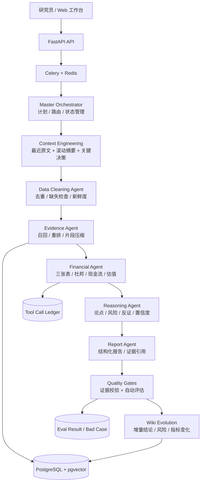
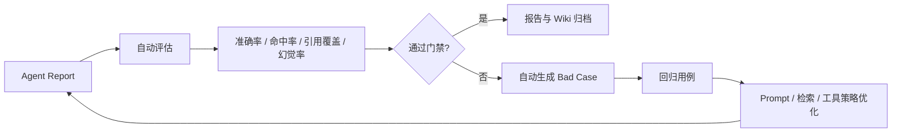
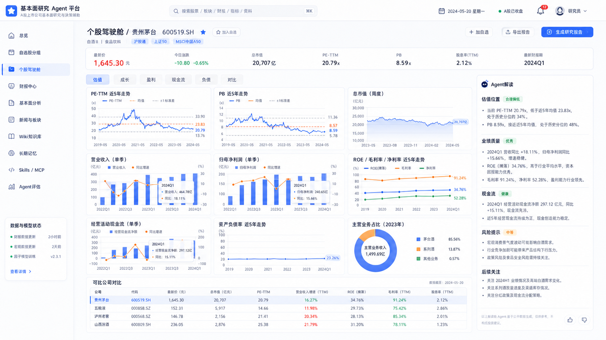
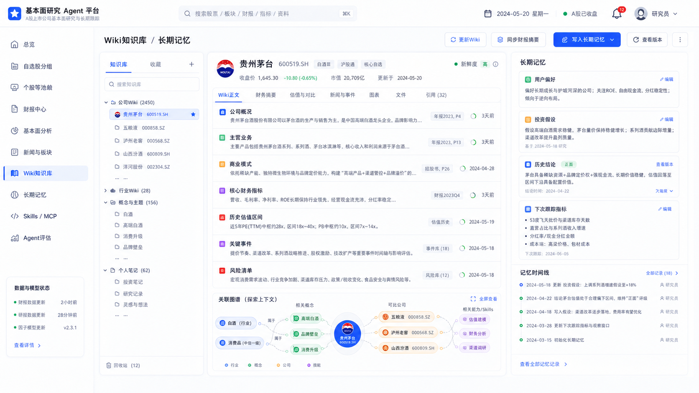
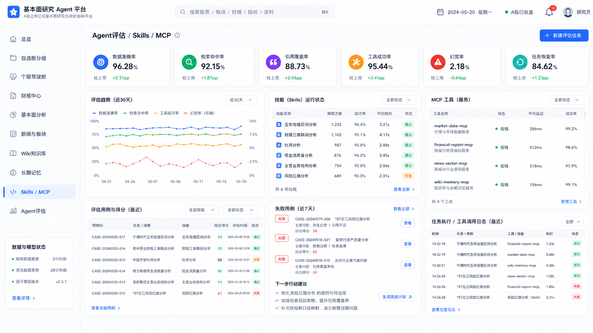
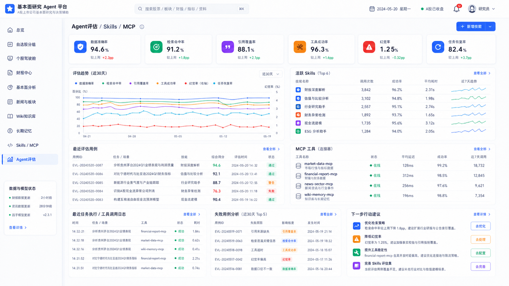

# A 股投研 Multi-Agent Platform

基于 **LangGraph + FastAPI + Vue 3** 构建的 A 股基本面研究系统。系统采用“主控 Agent + 专业执行 Agent”架构，把一次公司研究拆成数据清洗、证据检索、财务计算、逻辑推理、报告撰写、质量评估与 Wiki 写回，并通过结构化 State 串联整条链路。

[](https://www.python.org/)
[](https://fastapi.tiangolo.com/)
[](https://langchain-ai.github.io/langgraph/)
[](https://vuejs.org/)
[](https://docs.docker.com/compose/)

> 本项目用于工程学习与个人研究复盘，不构成投资建议。聚合数据可能存在延迟或口径差异，最终应以上市公司公告和交易所披露为准。

## 项目亮点

- **多 Agent 协作编排**：LangGraph 主控节点生成执行计划，专业节点分别负责数据清洗、财务计算、逻辑推理和报告撰写，统一 State 管理任务进度、节点产物和错误信息。
- **Context Engineering**：上下文按“最近原文 + 滚动摘要 + 关键决策”组织，报告节点只接收压缩证据与结构化分析结果；运行时记录压缩前后估算 Token 和节省率。
- **RAG 重排与片段压缩**：候选证据经过查询相关性、来源权重和基础召回分联合重排，再按字符预算压缩，减少长文本注意力衰减。
- **动态 Wiki 知识库**：每次分析自动提取财务指标变化、风险点、核心结论、评估状态和置信度，作为增量版本写回公司 Wiki，而不是覆盖历史认知。
- **Function Calling 工具层**：财务分析、杜邦拆解、现金流质量、估值区间和风险识别封装为可注册 Skill，调用输入、输出、耗时和状态统一落库。
- **评估与 Bad Case 回流**：逐任务计算数据准确率、检索命中率、引用覆盖率、工具成功率、完整度和幻觉率；未通过质量门禁的任务自动生成 Eval Case。

## 系统架构



## LangGraph 执行链

```mermaid
flowchart LR
    A["master_orchestrator"] --> B["load_context"]
    B --> C["data_cleaning_agent"]
    C --> D["retrieve_evidence"]
    D --> E["financial_calculation_agent"]
    E --> F["reasoning_agent"]
    F --> G["report_writer_agent"]
    G --> H["verify_evidence"]
    H --> I["evaluate_output"]
    I --> J["update_memory"]
```



| 节点 | 职责 | 结构化产物 |
| --- | --- | --- |
| `master_orchestrator` | 生成主控计划与质量门禁 | `master_plan` |
| `load_context` | 加载行情、财务与历史上下文 | `context_pack`、Token 估算 |
| `data_cleaning_agent` | 财务期间去重、缺失字段与新鲜度检查 | `cleaned_data` |
| `retrieve_evidence` | 候选证据召回、重排和压缩 | `compressed_evidence` |
| `financial_calculation_agent` | Function Calling 执行财务 Skills | `skill_results` |
| `reasoning_agent` | 合并论点、估值、现金流、风险与反证 | `reasoning_result` |
| `report_writer_agent` | 基于压缩上下文撰写报告 | `draft_report` |
| `verify_evidence` | 禁止性表述与证据数量门禁 | `verified_report` |
| `evaluate_output` | 计算质量指标并生成 Bad Case | `eval_result` |
| `update_memory` | 将高价值增量追加到 Wiki | `wiki_delta` |

## Context Engineering

传统 Agent 容易把历史报告、检索文档和中间结果全部塞进下一轮 Prompt。本项目把上下文分成三层：

```text
context_pack
├── recent_raw       # 最新股票摘要、最新财务期、最新估值点
├── rolling_summary  # 已完成工作和历史信息的滚动摘要
├── key_decisions    # 数字口径、证据约束、禁止项等稳定决策
├── source_manifest  # 数据源清单
└── token_metrics    # 压缩前后 Token 估算与节省率
```

报告 Agent 不读取完整原始文档，只接收 `context_pack + compressed_evidence + reasoning_result`。这种状态契约能减少节点耦合，也方便定位某个结论究竟来自数据、工具还是推理。

## Skills 与工具调用

| Skill | 作用 |
| --- | --- |
| `valuation_range_analysis` | 计算 PE/PB 历史分位与估值位置 |
| `three_statement_analysis` | 联动分析利润表、资产负债表和现金流量表 |
| `dupont_analysis` | 拆解 ROE 驱动因素 |
| `cashflow_quality_analysis` | 计算经营现金流与利润匹配程度 |
| `business_segment_analysis` | 分析业务结构与主要驱动 |
| `risk_red_flags_analysis` | 提取财务、行业和数据口径风险 |
| `investment_thesis_check` | 检查当前事实是否支持原研究假设 |

所有调用均写入 `tool_call_log`，保留工具名、类型、输入摘要、结构化输出、状态和耗时。金融数据提供方采用可替换 Provider 设计，已包含 AkShare、Tushare、巨潮资讯与 Mock Provider 接口。

## 知识库自我进化

Agent 不直接覆盖公司 Wiki，而是追加一条可追踪的研究增量：

```json
{
  "period": "2025Q4",
  "metrics": {"revenue_yoy": 12.4, "net_profit_yoy": 9.8},
  "risks": ["经营现金流转化下降"],
  "conclusions": ["盈利保持增长，但现金流质量需要跟踪"],
  "confidence": 0.85,
  "eval_status": "passed"
}
```

每条增量同时进入 `AgentMemory` 和 `WikiChunk`，带任务 ID、版本号、评估状态与置信度，可用于后续检索、结论对比和复盘。

## 评估闭环



当前评估为确定性规则评估：抽取报告数字并与证据账本匹配，检查证据来源数量、工具执行状态、必要章节和禁止性表述。指标来自每次真实任务执行，不在 README 中展示虚构百分比。

## 产品界面

| 个股研究驾驶舱 | Wiki 与长期记忆 |
| --- | --- |
|  |  |

| Skills / MCP / Eval | Agent 评估中心 |
| --- | --- |
|  |  |

## 技术栈

| 层级 | 技术 |
| --- | --- |
| Agent Runtime | LangGraph、TypedDict State、结构化节点契约 |
| Backend | Python 3.12、FastAPI、SQLAlchemy、Pydantic |
| Async Jobs | Celery、Redis、SSE 任务进度 |
| Data / RAG | PostgreSQL、pgvector、BM25、重排与片段压缩 |
| Frontend | Vue 3、TypeScript、Pinia、ECharts、Lucide Icons |
| Infrastructure | Docker Compose、Alembic |

## 项目结构

```text
backend/app/
├── agent/
│   ├── graph.py                 # LangGraph 主控-执行工作流
│   ├── state.py                 # 全局结构化 State 与节点清单
│   └── context_engineering.py   # 上下文组装、重排、压缩、Token 估算
├── skills/                      # 可注册财务分析 Skills
├── services/
│   ├── evals/quality.py         # 报告质量评估与失败原因
│   ├── rag/                     # 混合检索适配层
│   └── llm.py                   # OpenAI-compatible 模型调用
├── providers/                   # 金融数据 Provider
├── models/                      # 任务、报告、Wiki、Memory、Eval 模型
├── api/v1/                      # REST API 与 SSE
└── workers/                     # Celery Agent / Eval 任务
frontend/src/
├── views/                       # 投研驾驶舱、Wiki、评估中心
├── stores/                      # Pinia 状态管理
└── components/                  # 图表、表格与 Agent 状态组件
```

## Docker 启动

1. 创建环境配置：

```bash
cp .env.example .env
```

2. 在 `.env` 中配置 OpenAI-compatible 模型服务和需要的数据源密钥。

3. 启动完整服务：

```bash
docker compose up -d --build
```

4. 初始化演示数据：

```bash
docker compose exec backend python -m app.seed.seed_demo_data
```

5. 访问服务：

- Web 工作台：<http://localhost:5173>
- OpenAPI 文档：<http://localhost:8000/docs>
- 健康检查：<http://localhost:8000/health>

## 测试

```bash
docker compose exec backend pytest -q
```

核心测试覆盖 Context Pack 契约、RAG 重排压缩、财务 Skill 和评估 Bad Case 判定。端到端验证脚本位于 `backend/app/tests/verify_agent_flow.py`。

## 简历描述

**A 股投研 Multi-Agent 平台｜LangGraph / FastAPI / RAG / PostgreSQL / Vue 3**

- 基于 LangGraph 设计“主控-执行”多智能体架构，将投研任务拆解为数据清洗、财务计算、逻辑推理与报告撰写节点，通过 Typed State 管理全局上下文、节点进度与结构化产物。
- 设计 Context Engineering 机制，将上下文拆分为“最近原文 + 滚动摘要 + 关键决策”，结合证据重排、片段压缩与 Token 估算，减少节点间冗余信息传递和长文本注意力衰减。
- 构建 Wiki 动态知识库，Agent 自动提取关键财务指标变化、风险点、结论与置信度并增量写回，形成可版本化、可检索的长期研究记忆。
- 封装财务分析与金融数据工具，通过 Function Calling 记录完整调用链；建立数据准确率、引用覆盖率、幻觉率等评估指标，并将失败任务自动回流为 Bad Case。

## Roadmap

- 接入 Cross-Encoder / LLM Reranker，替换当前确定性重排器
- 增加 LangGraph Checkpointer，实现节点级暂停、恢复与人工审批
- 将 Eval Worker 从队列占位实现扩展为批量回归执行器
- 增加 Wiki 结论冲突检测和时间衰减策略
- 接入 OpenTelemetry，统一 Agent Trace、模型调用和工具调用观测

## License

当前仓库未附带开源许可证。未经许可，不代表允许复制、修改或商业使用。
