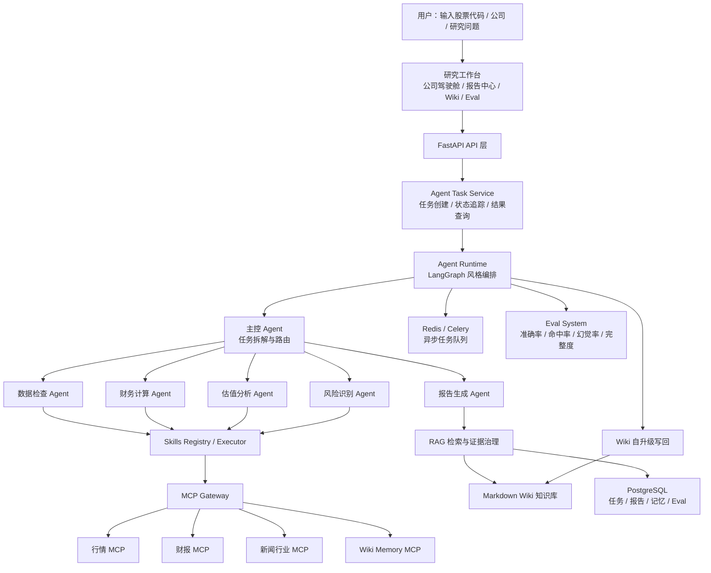
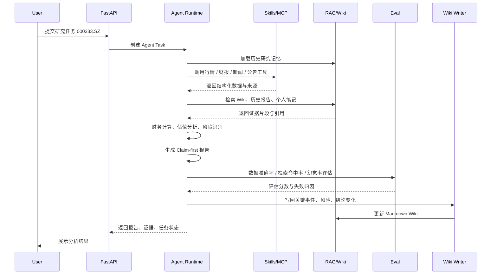
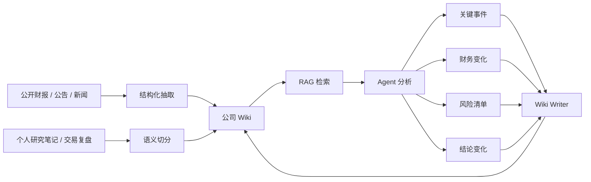
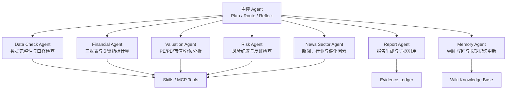
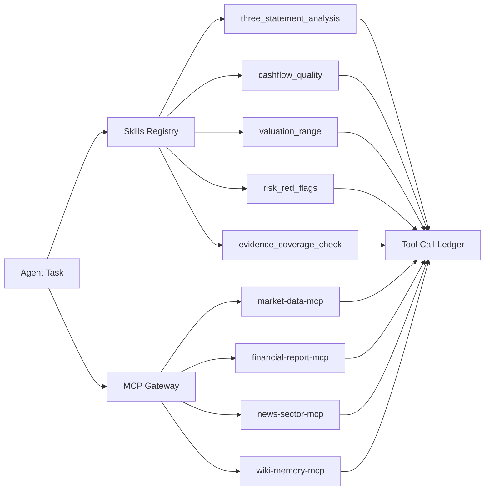
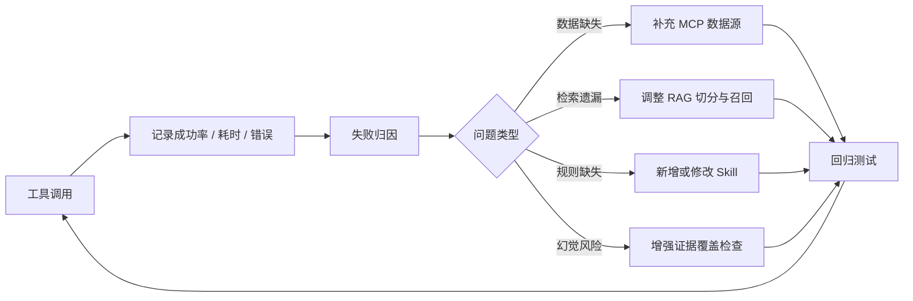
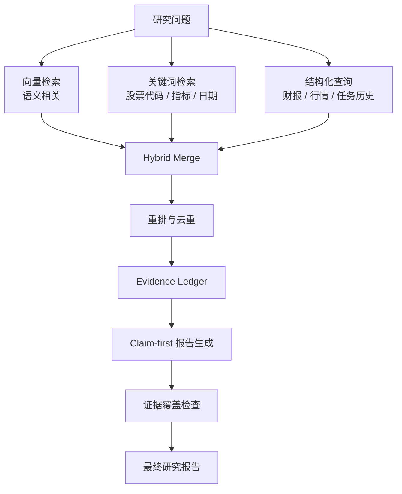
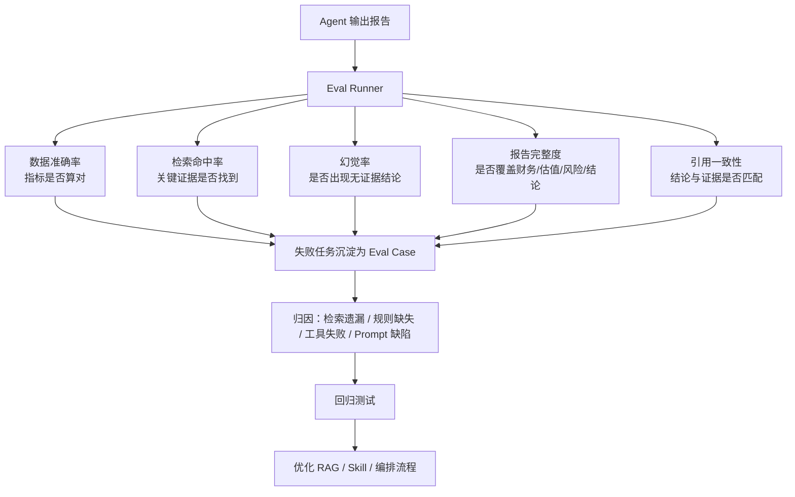
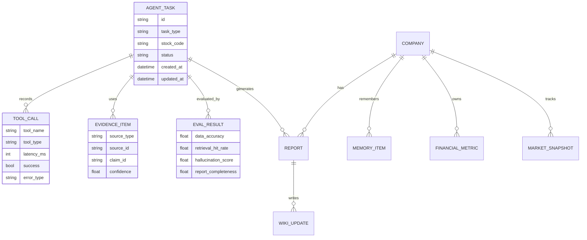

# A 股个人股票研究 Agent 平台

> 围绕公开财报、公告、新闻与个人研究记录，构建一个可沉淀、可复盘、可自我升级的股票研究 Agent 平台。项目重点不是“做一个行情页面”，而是把个人投资研究流程产品化：让 Agent 能查数据、读证据、调用工具、生成报告、写回 Wiki，并通过评估体系不断优化自己的分析链路。

[GitHub 项目地址](https://github.com/ljt-sss/A_stock_analysis_agent.git)

## 项目定位

这是一个面向中国 A 股基本面研究的 Agent 系统，目标是辅助个人完成公司基本面分析、交易复盘、研究笔记沉淀与长期跟踪。

平台将公开财报、公告、新闻、行情指标、研究笔记统一组织为 Wiki 知识库，并通过主控 Agent 编排多个专业子 Agent / Skills / MCP 工具完成研究任务。每次分析结束后，系统会把关键事件、财务信息、风险清单、结论变化写回 Wiki，逐步形成“越用越懂我的研究系统”。

> 免责声明：本项目仅用于学习、研究与个人复盘，不构成任何投资建议。公开数据可能存在延迟、缺失或口径差异，请以上市公司公告、交易所披露和权威数据源为准。

## 简历项目描述

个人股票研究 Agent 平台：围绕公开财报、公告、新闻及个人研究记录，构建包含 Wiki 知识库、多 Agent 协作、Skills/MCP 工具调用及长期记忆机制的平台，用于复盘个人股票操作与公司基本面分析。

核心职责：

- Wiki 知识库自我升级：构建公司、行业、指标及研究笔记知识库，将财报摘要、市值波动、财务状态与分析框架沉淀为 Markdown 知识库；Agent 完成分析后，自动将关键事件、财务信息、风险清单与结论变化写回 Wiki，实现知识库持续更新与自我升级。
- Agent 编排与 Skills/MCP 反馈优化：设计主控 + 多子 Agent 协作架构，将研究拆解为数据检查、财务计算、估值分析等节点；通过任务状态表记录调用链路，统计 Skills/MCP 工具成功率与耗时，用于优化分析规则与调用策略。
- 评估体系与持续自我优化：构建覆盖数据准确率、检索命中率、幻觉率及报告完整度的评估体系；将失败任务沉淀为 eval case，归因检索遗漏或规则缺失等问题，通过回归测试持续优化 RAG 策略与编排流程。

## 为什么做这个项目

个人股票研究最大的痛点不是“没有信息”，而是信息太分散：

- 财报在公告里，行情在行情源里，新闻在资讯站里，研究判断在自己的笔记里；
- 每次复盘都要重复查数据、翻历史结论、找当时买入/卖出的理由；
- LLM 可以生成分析，但如果没有证据约束、工具调用记录和长期记忆，很容易变成一次性问答；
- 股票研究需要持续跟踪，“上一次结论为什么改变”往往比“这一次结论是什么”更重要。

因此本项目把重点放在 Agent 工程能力上：任务编排、证据治理、工具调用、长期记忆、Wiki 自升级、评估闭环，而不是单纯展示前后端页面。

## 核心能力一览

| 能力模块 | 解决的问题 | 当前实现方向 |
| --- | --- | --- |
| 主控 Agent 编排 | 把一次研究拆成可追踪、可恢复的节点 | LangGraph 风格任务图、任务状态表、节点级状态记录 |
| 多子 Agent / Skills | 将财务、估值、风险、行业分析拆成专业能力 | 内置 Skills 注册表、Skill Executor、可扩展 Skill.md 描述 |
| MCP 工具调用 | 将行情、财报、新闻、Wiki 记忆封装成标准工具 | market-data、financial-report、news-sector、wiki-memory MCP 服务 |
| Wiki 知识库 | 沉淀公司、行业、指标、研究笔记 | Markdown 化知识库、结构化 Wiki API、自动写回机制 |
| RAG 检索增强 | 让报告基于证据，而不是模型空想 | 混合检索、证据片段、引用约束、证据覆盖检查 |
| 长期记忆 | 记录个人研究偏好、历史判断与结论变化 | Memory 模型、记忆更新节点、公司级研究上下文 |
| 证据账本 | 保留每条结论背后的来源、时间和置信度 | Evidence Ledger、报告引用、幻觉检查 |
| Eval 评估体系 | 让失败变成可回归的测试样本 | 数据准确率、检索命中率、幻觉率、报告完整度 |
| 任务可观测 | 追踪每个工具、节点、Agent 的耗时和成功率 | 任务状态表、调用链路、Skills/MCP 统计 |
| Docker 部署 | 降低本地环境污染和复现成本 | Docker Compose 启动后端、前端、PostgreSQL、Redis |

## 整体架构



## Agent 工作流

一次完整的公司基本面研究任务，会被拆成多个可观察节点：



## Wiki 知识库自我升级机制

本项目的一个重点是“分析不是终点，沉淀才是终点”。每次 Agent 生成报告后，都会把新的结构化结论写回 Wiki。



Wiki 目录建议：

```text
wiki/
├── companies/
│   └── 000333.SZ_美的集团.md
├── industries/
│   └── 家电行业.md
├── metrics/
│   ├── ROE.md
│   ├── PE_TTM.md
│   └── 经营现金流.md
├── research-notes/
│   └── 2026-06-23_美的集团复盘.md
└── eval-cases/
    └── 000333.SZ_财报口径缺失案例.md
```

写回内容示例：

| 写回类型 | 示例内容 | 作用 |
| --- | --- | --- |
| 关键事件 | 年报发布、重大收购、分红变化、管理层变化 | 支撑后续事件复盘 |
| 财务信息 | 营收、归母净利、毛利率、ROE、现金流质量 | 形成公司长期财务画像 |
| 风险清单 | 应收账款上升、毛利率下滑、估值分位偏高 | 下次分析自动提醒 |
| 结论变化 | 从“现金流稳健”调整为“需关注库存压力” | 保留研究观点演进 |
| 证据引用 | 公告链接、新闻来源、财报页码、数据时间 | 降低幻觉与误判 |

## 多 Agent 协作设计



各 Agent 的职责边界：

| Agent | 输入 | 输出 | 关键约束 |
| --- | --- | --- | --- |
| Data Check Agent | 股票代码、公司名、时间范围 | 数据可用性、缺失字段、数据时间戳 | 不允许用模拟数据冒充真实数据 |
| Financial Agent | 财报、财务摘要、三张表 | 营收、利润、ROE、现金流、负债率等指标 | 保留计算公式和数据来源 |
| Valuation Agent | 行情、市值、PE/PB、历史区间 | 估值位置、历史分位、同业对比 | 明确估值不等于投资建议 |
| Risk Agent | 财报异常、新闻、历史风险 | 风险红旗、反证清单、关注事项 | 优先寻找反证，避免单边乐观 |
| News Sector Agent | 新闻、行业事件、政策变化 | 行业热度、短期催化、潜在冲击 | 区分事实、传闻和模型推断 |
| Report Agent | 证据账本、指标、记忆 | 结构化 Markdown 研究报告 | 每个核心结论必须绑定证据 |
| Memory Agent | 报告结论、评估结果、历史 Wiki | Wiki 更新、长期记忆更新 | 只写入高置信、可追溯内容 |

## Skills / MCP 工具体系

本项目将能力分为两层：

- Skills：偏“分析方法”，例如三张表分析、杜邦分析、现金流质量、估值区间、风险红旗检查；
- MCP：偏“外部工具与数据连接”，例如行情数据、财报数据、新闻行业数据、Wiki 记忆读写。



内置 Skills 示例：

| Skill | 作用 |
| --- | --- |
| `three_statement_analysis` | 分析利润表、资产负债表、现金流量表之间的勾稽关系 |
| `cashflow_quality` | 检查净利润与经营现金流是否匹配，识别利润质量问题 |
| `dupont_analysis` | 拆解 ROE 来源，区分利润率、周转率和杠杆贡献 |
| `valuation_range` | 结合 PE/PB、市值变化与历史区间判断估值位置 |
| `risk_red_flags` | 识别财务、经营、估值、治理等风险红旗 |
| `peer_comparison_analysis` | 与同行公司做横向对比 |
| `investment_thesis_check` | 检查当前事实是否支持原始投资假设 |
| `evidence_coverage_check` | 检查报告结论是否有足够证据覆盖 |

## Skills/MCP 反馈优化

所有 Skills 和 MCP 调用都会写入任务状态表，用于后续分析工具质量：

| 观测指标 | 用途 |
| --- | --- |
| 成功率 | 判断工具是否稳定，是否需要降级或替换数据源 |
| 平均耗时 | 优化调用顺序、缓存策略和超时配置 |
| 失败原因 | 区分网络问题、参数错误、数据缺失、解析失败 |
| 输入输出规模 | 控制上下文长度和 RAG 片段数量 |
| 命中证据数量 | 判断检索策略是否有效 |
| 对最终报告贡献度 | 评估工具是否真正影响结论 |

优化闭环：



## RAG 与证据治理

本项目不鼓励 Agent 直接“凭感觉写报告”。报告生成前，需要先整理证据账本：



证据账本字段示例：

| 字段 | 说明 |
| --- | --- |
| `source_type` | 财报、公告、新闻、Wiki、个人笔记、行情数据 |
| `source_id` | 来源 ID、文件路径、URL 或数据库主键 |
| `published_at` | 来源发布时间 |
| `retrieved_at` | 系统检索时间 |
| `content_snippet` | 证据片段 |
| `related_claim` | 支撑的结论 |
| `confidence` | 证据置信度 |
| `freshness` | 数据新鲜度 |

## 评估体系与持续自我优化

评估不是附属功能，而是 Agent 能不能持续进化的核心。



评估维度：

| 评估项 | 判断标准 |
| --- | --- |
| 数据准确率 | 财务指标、同比、环比、估值指标是否与源数据一致 |
| 检索命中率 | 是否找到了公司关键公告、财报摘要、历史研究结论 |
| 幻觉率 | 是否出现无来源、无证据、无法复核的判断 |
| 报告完整度 | 是否覆盖业务、财务、估值、风险、结论、后续跟踪点 |
| 引用一致性 | 引用证据是否真的支持对应结论 |
| Wiki 写回质量 | 是否只写入高价值、可追踪、非重复信息 |

失败样本会被沉淀为 eval case，用于后续回归测试。例如：

```yaml
case_id: 000333_cashflow_quality_2026q1
stock: 000333.SZ
failure_type: calculation_error
expected:
  - 经营现金流与净利润需要同时展示
  - 现金流质量结论必须引用现金流量表
actual:
  - 报告只引用净利润，未引用经营现金流
fix_plan:
  - 调整 cashflow_quality Skill
  - 增加 evidence_coverage_check 规则
```

## 长期记忆设计

长期记忆分为三类：

| 记忆类型 | 内容 | 用途 |
| --- | --- | --- |
| 公司记忆 | 公司业务、核心指标、历史风险、跟踪事件 | 下一次分析自动加载公司背景 |
| 个人研究记忆 | 买入/卖出理由、关注指标、研究偏好 | 让 Agent 贴合个人投资框架 |
| 系统优化记忆 | 失败案例、工具问题、检索缺陷 | 用于优化 Skills/MCP/RAG |

记忆更新遵循三个原则：

1. 可追溯：每条记忆需要来源和时间。
2. 高价值：只写入能影响后续研究的问题、事件或结论变化。
3. 可覆盖：新事实可以更新旧结论，但要保留观点变化历史。

## 数据模型概览



## 当前功能

- A 股公司搜索与基础信息展示；
- 个股研究任务创建、状态追踪与结果查询；
- 近五年季度维度的财务指标、PE/PB、市值变化分析；
- 三张表分析、现金流质量、估值区间、风险红旗等内置 Skills；
- 基于公开数据和 Wiki 证据生成 Markdown 研究报告；
- 报告中心、Wiki 记忆、Skills/MCP 观测、Agent Eval 页面；
- 支持 DeepSeek / OpenAI-compatible LLM 接口；
- PostgreSQL 存储任务、报告、记忆与评估结果；
- Redis + Celery 支持异步任务；
- Docker Compose 一键启动。

## 页面与展示模块

| 页面 | 展示重点 |
| --- | --- |
| 公司驾驶舱 | 公司基础信息、核心指标、行情、估值、财务摘要 |
| 个股研究 | 输入股票代码后触发 Agent 基本面分析 |
| 报告中心 | 查看历史报告、Markdown 报告与证据引用 |
| Wiki 记忆 | 公司知识库、行业知识库、研究笔记、长期记忆 |
| Skills/MCP | 工具调用状态、成功率、耗时、错误原因 |
| Agent Eval | 数据准确率、检索命中率、幻觉率、报告完整度 |
| 自选监控 | 跟踪关注股票的关键变化 |
| 新闻行业 | 新闻、行业事件、政策变化与催化因素 |

项目中也包含 `ui-reference/images` 目录，用于展示 Agent 平台的产品原型与页面参考。

## 技术栈

| 层级 | 技术 |
| --- | --- |
| Agent Runtime | LangGraph 风格编排、状态机、任务节点、证据校验 |
| LLM | OpenAI-compatible API、DeepSeek Chat |
| RAG | Hybrid Retriever、Embedding Adapter、Wiki 检索、证据账本 |
| Skills | Skill Registry、Skill Executor、内置财务与风险分析 Skills |
| MCP | market-data、financial-report、news-sector、wiki-memory |
| Backend | FastAPI、SQLAlchemy、Alembic、Celery、Redis |
| Frontend | Vue 3、TypeScript、Vite、ECharts |
| Storage | PostgreSQL、Markdown Wiki、Redis |
| Deploy | Docker Compose |
| Eval | 自定义 Eval Runner、失败案例沉淀、回归测试 |

## 目录结构

```text
.
├── backend/
│   ├── app/
│   │   ├── agent/              # Agent 状态、图编排、节点与 Prompt
│   │   ├── api/                # FastAPI 路由
│   │   ├── mcp_clients/        # MCP 客户端封装
│   │   ├── models/             # 数据模型
│   │   ├── services/           # LLM、RAG、股票数据、Eval 服务
│   │   ├── skills/             # Skills 注册、执行与内置技能
│   │   └── workers/            # Celery 异步任务
│   └── alembic/                # 数据库迁移
├── frontend/
│   └── src/
│       ├── views/              # 公司驾驶舱、Wiki、Eval、报告中心等页面
│       ├── components/         # 通用组件与 Agent 面板
│       ├── api/                # API Client
│       └── stores/             # 前端状态管理
├── mcp_servers/
│   ├── market-data-mcp/
│   ├── financial-report-mcp/
│   ├── news-sector-mcp/
│   └── wiki-memory-mcp/
├── docs/
│   ├── agent-technical-solution.md
│   ├── agent-workflow.md
│   ├── architecture.md
│   ├── database.md
│   └── eval-system.md
├── ui-reference/images/
├── docker-compose.yml
└── README.md
```

## 快速启动

所有运行和依赖安装建议在 Docker 中完成，避免污染本地环境。

```powershell
Copy-Item .env.example .env
# 编辑 .env，填入 OPENAI_COMPAT_API_KEY 等配置
docker compose up -d --build
```

访问地址：

- 前端页面：http://localhost:5173
- API 文档：http://localhost:8000/docs
- 健康检查：http://localhost:8000/health

## 必要配置

```env
DATA_PROVIDER=akshare
EMBEDDING_PROVIDER=disabled
LLM_PROVIDER=openai_compat
OPENAI_COMPAT_BASE_URL=https://api.deepseek.com
OPENAI_COMPAT_API_KEY=your_api_key
OPENAI_COMPAT_DEFAULT_MODEL=deepseek-chat
LLM_TIMEOUT_SECONDS=90
AKSHARE_ENABLED=true
```

## 常用 API

创建基本面分析任务：

```http
POST /api/v1/agent/tasks/fundamental-analysis
Content-Type: application/json

{
  "ts_code": "000333.SZ"
}
```

查询任务状态：

```http
GET /api/v1/agent/tasks/{task_id}
```

查看报告：

```http
GET /api/v1/reports
```

查看 Eval：

```http
GET /api/v1/evals
```

## 验证命令

```powershell
docker compose exec backend pytest -q
docker compose exec frontend npm run build
```

如果容器尚未启动：

```powershell
docker compose up -d --build
```

## 报告输出结构

Agent 生成的研究报告采用 Claim-first 结构：

```text
1. 核心结论
2. 公司与业务概览
3. 财务表现
   - 营收与利润
   - 毛利率、净利率、ROE
   - 经营现金流质量
4. 估值分析
   - PE/PB
   - 市值变化
   - 历史区间与同业对比
5. 风险红旗
6. 与历史研究结论的变化
7. 后续跟踪指标
8. 证据引用
9. Wiki 写回摘要
```

## 项目亮点

1. 不是一次性问答，而是可复盘、可沉淀、可升级的 Agent 平台。
2. 将个人股票研究流程拆成多个专业 Agent 和 Skills，便于扩展与评估。
3. 使用 MCP 思路连接行情、财报、新闻、Wiki 记忆等工具，工具调用可观测。
4. 通过证据账本和 Eval 体系降低幻觉，让每条关键结论都有来源。
5. 自动把分析结果写回 Markdown Wiki，让知识库随着使用持续进化。
6. 失败任务会沉淀为 eval case，通过回归测试持续优化 RAG、Skills 与编排流程。
7. Docker-first，便于复现、演示和部署。

## 后续规划

- 引入真实公告 PDF 解析和页码级引用；
- 增强 Wiki 双向链接与公司事件时间线；
- 增加个人交易记录导入与复盘 Agent；
- 增加同业公司自动匹配与估值分位计算；
- 接入更多公开数据源并记录数据源可靠性；
- 支持 Agent 任务断点恢复、重试和人工确认节点；
- 为 Skills/MCP 调用建立更完整的 dashboard；
- 将 Eval case 与 CI 结合，形成自动回归测试。

## License

本项目用于个人学习、研究和简历项目展示。如需用于生产或投资决策，请自行补充数据授权、风控、合规与安全审查。
