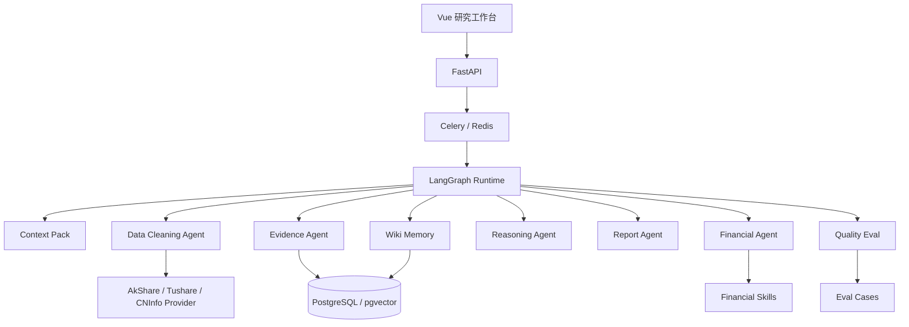
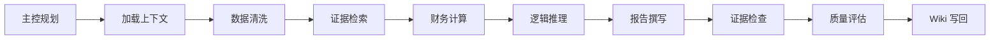
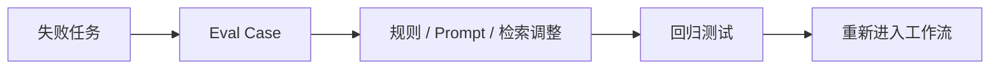

# A 股基本面研究 Agent 平台

这是一个用于个人股票研究与复盘的工程项目。

我希望解决的问题并不是“让大模型写一篇股票分析”，而是把一次基本面研究拆成一条可执行的工作流：先检查数据，再查找证据、计算指标、识别风险、生成报告，最后做质量评估并把有效结论写回知识库。

[](https://www.python.org/)
[](https://fastapi.tiangolo.com/)
[](https://langchain-ai.github.io/langgraph/)
[](https://vuejs.org/)
[](https://docs.docker.com/compose/)

> 项目用于工程学习和个人研究，不构成投资建议。财务及行情数据可能存在延迟或口径差异，请以上市公司公告和交易所披露为准。

## 项目解决什么问题

个人做股票研究时，常见问题并不是缺少一段分析文字，而是：

- 财报、行情、公告和笔记分散，分析过程难以复现；
- 模型容易跳过数据口径，直接给出听起来合理的结论；
- 一次报告完成后，结论和风险点没有沉淀，下次还要重新整理；
- 工具调用失败、证据不足或数字错误时，很难知道问题出在哪个环节。

因此项目重点放在工作流、证据和评估，而不是聊天界面。

## 已实现功能

- 输入 A 股代码，查看公司摘要、季度财务数据、估值序列和三张表数据；
- 创建基本面分析任务，实时查看 Agent 节点进度和工具调用记录；
- 通过财务 Skills 计算估值分位、现金流质量、杜邦拆解和风险项；
- 为报告保留证据账本，记录来源、报告期和支撑结论；
- 对报告数字、引用覆盖和禁止性表述做自动检查；
- 将未通过检查的任务转成 Eval Case，供后续回归；
- 将指标变化、风险点和结论增量写回公司 Wiki；
- 提供 Mission Control、个股研究、能力中心和报告归档页面。

## 产品界面

| Agent Mission Control | 个股基本面研究 |
| --- | --- |
|  |  |

Mission Control 用于查看任务节点、证据、工具调用和记忆写回；个股研究页用于核对真实行情、财务趋势和三张表数据，并发起分析任务。

## 整体架构



后端采用 FastAPI 提供接口，Celery 负责异步任务，LangGraph 管理分析节点和状态流转。任务、报告、证据、工具日志、评估结果和 Wiki 版本统一保存在 PostgreSQL 中。

## 一次分析如何执行



| 节点 | 主要工作 | 输出 |
| --- | --- | --- |
| `master_orchestrator` | 确定执行节点和质量门禁 | `master_plan` |
| `load_context` | 读取行情、财务和研究上下文 | `context_pack` |
| `data_cleaning_agent` | 去重、检查缺失字段和数据新鲜度 | `cleaned_data` |
| `retrieve_evidence` | 召回、重排并压缩证据片段 | `compressed_evidence` |
| `financial_calculation_agent` | 调用财务分析 Skills | `skill_results` |
| `reasoning_agent` | 整理论点、估值、风险和反证 | `reasoning_result` |
| `report_writer_agent` | 根据结构化输入撰写报告 | `draft_report` |
| `verify_evidence` | 检查证据数量和禁止性表述 | `verified_report` |
| `evaluate_output` | 计算质量指标，生成失败原因 | `eval_result` |
| `update_memory` | 追加公司 Wiki 和长期记忆 | `wiki_delta` |

这里的“多 Agent”不是同时开多个聊天窗口，而是把不同职责做成边界清晰的执行节点。每个节点只返回约定字段，方便记录、重试和定位问题。

## 我重点处理的几个问题

### 1. 控制节点间上下文

如果把历史报告、财务数据、检索文档和所有中间结果不断传给后续模型，Prompt 会快速膨胀，重要信息也容易被淹没。

项目将上下文拆成三部分：

```text
context_pack
├── recent_raw       # 最近一期财务和估值数据
├── rolling_summary  # 前序信息的滚动摘要
├── key_decisions    # 数据口径、证据要求和禁止项
└── token_metrics    # 压缩前后的估算 Token
```

报告节点只接收压缩后的证据、推理结果和 Context Pack，不直接读取全部原始材料。

### 2. 让结论能够追溯

证据检索会综合查询相关性、来源类型和召回分数进行重排，再按长度预算压缩片段。报告保存时，同时保存 `AnalysisEvidence`：

- 证据来源；
- 对应报告期；
- 原始片段；
- 支撑的指标或结论。

这样在复核报告时，可以区分“数据事实”“工具计算”和“模型判断”。

### 3. 避免知识库只增不管

Agent 不会直接覆盖公司 Wiki，而是追加一条研究增量，包括：

```json
{
  "period": "2025Q4",
  "metrics": {
    "revenue_yoy": 12.4,
    "net_profit_yoy": 9.8
  },
  "risks": ["经营现金流转化下降"],
  "conclusions": ["盈利增长，但现金流质量需要继续跟踪"],
  "confidence": 0.85,
  "eval_status": "passed"
}
```

每次更新带有任务 ID、版本号、评估状态和置信度，旧结论仍然保留，便于比较观点变化。

### 4. 把失败任务留下来

当前评估器会检查：

- 报告中的数字能否在证据账本中找到；
- 核心章节是否完整；
- 证据来源是否足够；
- Skills 是否成功执行；
- 是否出现目标价、保证收益等禁止性表述。

未通过检查的任务会自动生成 Bad Case，而不是只在日志里报错。



## Skills 与数据工具

| Skill | 用途 |
| --- | --- |
| `valuation_range_analysis` | 计算 PE/PB 历史分位 |
| `three_statement_analysis` | 检查利润、资产和现金流之间的关系 |
| `dupont_analysis` | 拆解 ROE 变化来源 |
| `cashflow_quality_analysis` | 计算经营现金流与利润匹配程度 |
| `business_segment_analysis` | 分析业务结构 |
| `risk_red_flags_analysis` | 提取财务和经营风险 |
| `investment_thesis_check` | 检查事实是否支持原研究假设 |

每次调用都会记录工具名、输入摘要、结构化输出、执行状态和耗时。数据访问层采用 Provider 接口，便于替换 AkShare、Tushare、巨潮资讯或测试数据源。

## 技术栈

| 模块 | 技术 |
| --- | --- |
| Agent 编排 | LangGraph、TypedDict State |
| 后端 | Python 3.12、FastAPI、SQLAlchemy、Pydantic |
| 异步任务 | Celery、Redis |
| 数据与检索 | PostgreSQL、pgvector、BM25 |
| 前端 | Vue 3、TypeScript、Pinia、ECharts |
| 部署 | Docker Compose、Alembic |

## 项目结构

```text
backend/app/
├── agent/                 # LangGraph、State、Context Engineering
├── skills/                # 财务分析 Skills
├── providers/             # 金融数据 Provider
├── services/evals/        # 报告质量评估
├── services/rag/          # 检索与重排
├── models/                # Task、Report、Evidence、Wiki、Eval
├── api/v1/                # REST API 与任务进度接口
└── workers/               # Celery 任务

frontend/src/
├── views/                 # Mission Control、个股研究、能力中心
├── components/dashboard/  # 工作流、证据、工具日志、记忆组件
├── stores/                # Pinia 状态管理
└── api/                   # 前端 API 封装
```

更详细的技术设计见 [Agent 技术方案](docs/agent-technical-solution.md)。

## Docker 启动

```bash
cp .env.example .env
docker compose up -d --build
docker compose exec backend python -m app.seed.seed_demo_data
```

访问地址：

- Web：<http://localhost:5173>
- OpenAPI：<http://localhost:8000/docs>
- Health：<http://localhost:8000/health>

运行测试：

```bash
docker compose exec backend pytest -q
docker compose exec frontend npm run build
```

## 面试时可以展开的设计点

- 为什么使用 LangGraph State，而不是把流程写成一个超长函数；
- 如何限制节点上下文，避免完整文档在链路中反复传递；
- 证据片段如何重排、压缩并与报告结论关联；
- 财务计算为什么放在确定性 Skill 中，而不是交给模型心算；
- Wiki 为什么采用增量版本，而不是覆盖最新结论；
- Bad Case 如何从线上任务转成可重复执行的回归用例；
- 异步任务、工具日志和节点状态如何支撑问题排查。

## 当前边界

这个项目仍有一些明确的工程边界：

- 当前重排器以确定性规则和 BM25 为主，尚未接入 Cross-Encoder；
- Eval 主要检查数字、章节和引用覆盖，不等同于完整的投研质量判断；
- LangGraph 暂未配置持久化 Checkpointer，节点级恢复仍需完善；
- 不同金融数据源存在口径差异，报告仍需结合公告原文复核；
- 当前系统只做研究辅助，不输出交易建议、目标价或收益承诺。

这些边界会直接影响下一步优化顺序，而不是用更多 Prompt 掩盖。

## 简历描述

**A 股基本面研究 Agent 平台｜LangGraph / FastAPI / PostgreSQL / Vue 3**

- 基于 LangGraph 实现主控与专业执行节点，将研究任务拆为数据清洗、证据检索、财务计算、逻辑推理、报告生成和知识写回，并通过结构化 State 管理节点产物和任务进度。
- 将上下文拆分为最近原文、滚动摘要和关键决策，结合证据重排与片段压缩，减少节点间重复传递的内容。
- 封装估值、三张表、现金流和风险识别 Skills，记录工具输入、输出、耗时和执行状态，使财务计算过程可复核。
- 建立报告数字匹配、引用覆盖和禁止性表述检查，将失败任务自动沉淀为 Eval Case；将通过评估的指标变化、风险和结论增量写回 Wiki。

## License

当前仓库未附带开源许可证。未经许可，不代表允许复制、修改或商业使用。
