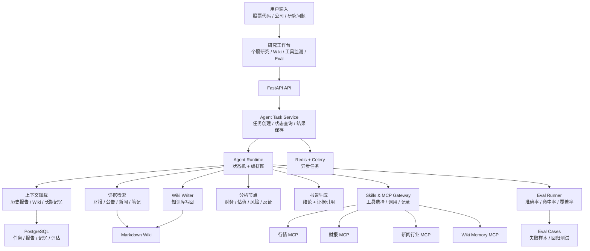
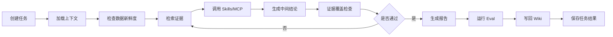
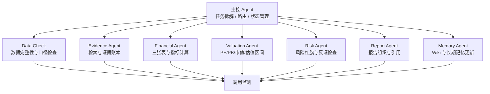
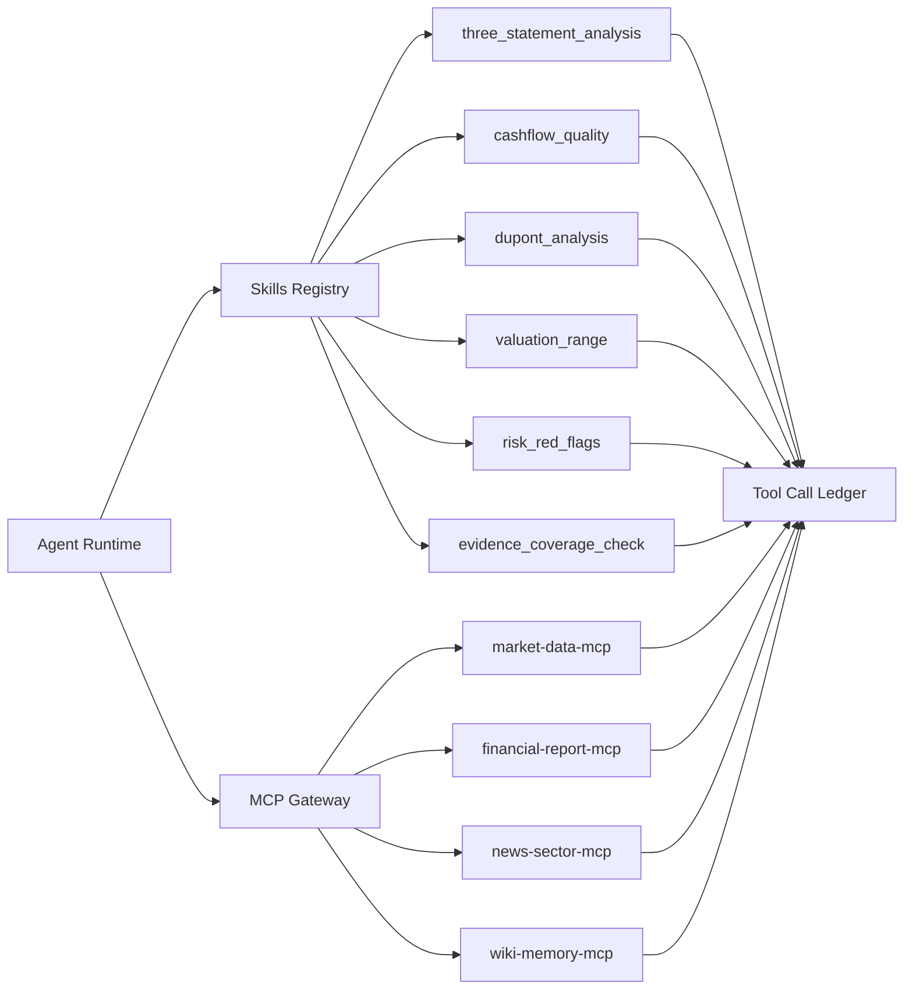
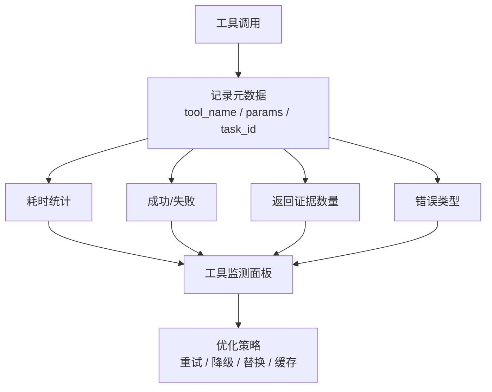
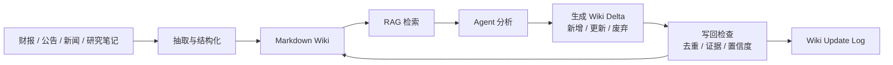
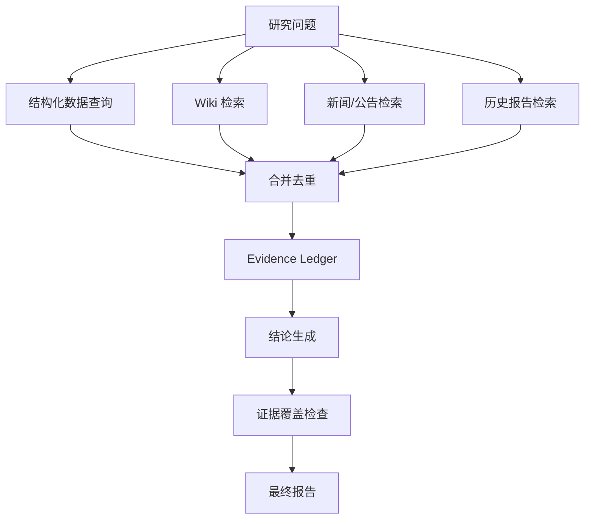
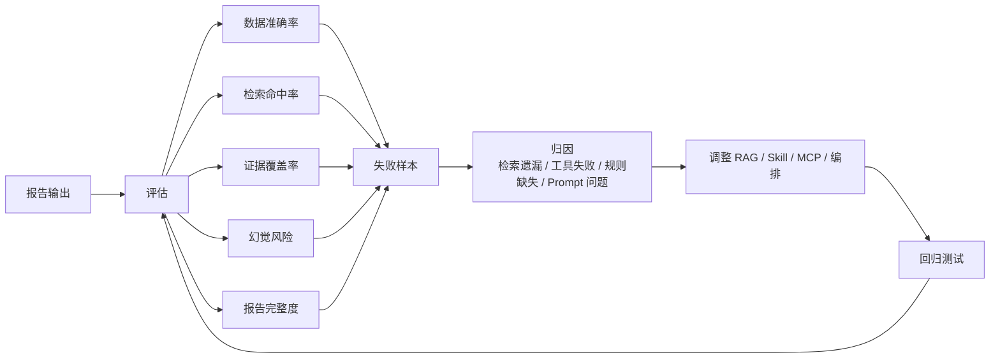
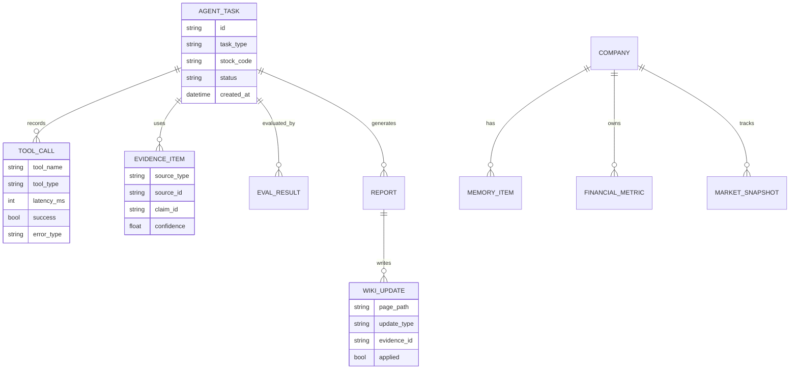

# A 股研究 Agent 平台

面向个人股票研究与复盘的 Agent 系统。项目围绕公开财报、公告、新闻、行情数据和个人研究笔记，构建 Wiki 知识库、多 Agent 编排、Skills/MCP 工具调用、长期记忆和评估回归机制，用于持续跟踪公司基本面、记录研究结论变化，并把每次分析沉淀回知识库。

项目地址：[https://github.com/ljt-sss/A_stock_analysis_agent](https://github.com/ljt-sss/A_stock_analysis_agent)

> 本项目用于学习、研究和个人复盘，不构成投资建议。财务和行情数据可能存在延迟、缺失或口径差异，最终应以上市公司公告、交易所披露和权威数据源为准。

## 项目重点

这个项目的核心不是前端页面，也不是简单调用大模型生成一段分析文本，而是把股票研究流程拆成可执行、可观测、可迭代的 Agent 工作流：

- Agent 负责拆解研究任务、选择工具、管理状态、生成带证据的结论；
- Skills/MCP 负责连接财报、行情、新闻、Wiki、财务计算等工具能力；
- Wiki 知识库负责沉淀公司、行业、指标、研究笔记和历史结论；
- 监测模块负责记录工具调用链路、成功率、耗时、失败原因和证据覆盖情况；
- Eval 模块负责把失败任务转成回归用例，推动检索、规则和编排流程持续优化。

## 简历项目描述

个人股票研究 Agent 平台：围绕公开财报、公告、新闻及个人研究记录，构建包含 Wiki 知识库、多 Agent 协作、Skills/MCP 工具调用及长期记忆机制的平台，用于复盘个人股票操作与公司基本面分析。

职责拆解：

- Wiki 知识库自我更新：设计公司、行业、指标和研究笔记知识库，将财报摘要、市值波动、财务状态、风险清单和分析框架沉淀为 Markdown；Agent 完成分析后，将关键事件、财务指标、风险变化和结论调整写回 Wiki。
- Agent 编排与工具反馈优化：设计主控 Agent + 专业节点的任务流，将研究过程拆成数据检查、证据检索、财务计算、估值分析、风险识别、报告生成、Wiki 写回等阶段；记录 Skills/MCP 调用链路、成功率和耗时，用于优化工具选择和调用策略。
- 评估体系与持续改进：构建覆盖数据准确率、检索命中率、证据覆盖率、幻觉风险和报告完整度的评估体系；将失败任务沉淀为 eval case，通过回归测试定位检索遗漏、规则缺失或工具异常。

## 整体架构



## Agent 任务流

一次基本面分析任务不是单次 LLM 调用，而是一条可追踪的流程。



关键节点：

| 节点 | 作用 | 产物 |
| --- | --- | --- |
| 加载上下文 | 读取公司历史报告、Wiki、长期记忆 | 研究背景、历史结论 |
| 检查数据新鲜度 | 确认财报、行情、新闻的时间戳 | 缺失字段、数据时间范围 |
| 检索证据 | 从 Wiki、公告、财报、新闻中召回材料 | Evidence Items |
| 调用 Skills/MCP | 执行财务计算、估值、风险识别、外部数据获取 | Tool Calls |
| 证据覆盖检查 | 检查结论是否有证据支撑 | 覆盖率、缺口列表 |
| 生成报告 | 输出结构化 Markdown 报告 | Report |
| Eval | 评估准确率、命中率、完整度 | Eval Result |
| Wiki 写回 | 更新公司 Wiki、风险清单、结论变化 | Wiki Update |

## 多 Agent / 节点职责



| 模块 | 输入 | 输出 | 设计约束 |
| --- | --- | --- | --- |
| 主控 Agent | 用户问题、股票代码、任务类型 | 节点执行顺序、任务状态 | 不直接写结论，负责协调 |
| Data Check | 行情、财报、公告元数据 | 数据缺失、口径差异、新鲜度 | 不用模拟数据冒充真实数据 |
| Evidence Agent | 查询问题、Wiki、财报、新闻 | 证据片段、来源、时间戳 | 证据必须可追溯 |
| Financial Agent | 利润表、资产负债表、现金流量表 | ROE、毛利率、现金流质量等 | 保留计算口径 |
| Valuation Agent | PE、PB、市值、历史区间 | 估值位置、同业对比 | 估值结论必须带假设 |
| Risk Agent | 财务异常、新闻事件、历史风险 | 风险红旗、反证清单 | 优先发现反证 |
| Report Agent | 证据账本、指标、节点结果 | Markdown 研究报告 | 核心结论绑定证据 |
| Memory Agent | 报告结论、Eval 结果、历史 Wiki | Wiki 更新、长期记忆 | 只写入高置信内容 |

## Skills 与 MCP 工具层

Skills 和 MCP 是本项目的工具层。它们被设计成可注册、可观测、可替换的能力，而不是写死在报告生成逻辑里。



内置 Skills：

| Skill | 作用 |
| --- | --- |
| `three_statement_analysis` | 分析利润表、资产负债表、现金流量表之间的关系 |
| `cashflow_quality` | 检查净利润与经营现金流是否匹配 |
| `dupont_analysis` | 拆解 ROE 来源 |
| `valuation_range` | 分析 PE/PB、市值变化和估值区间 |
| `risk_red_flags` | 识别财务、经营、估值和治理风险 |
| `peer_comparison_analysis` | 与同行公司做横向对比 |
| `investment_thesis_check` | 检查当前事实是否支持原始投资假设 |
| `evidence_coverage_check` | 检查报告结论是否有足够证据支撑 |

MCP 服务：

| MCP | 连接对象 | 用途 |
| --- | --- | --- |
| `market-data-mcp` | 行情、市值、估值指标 | 获取价格、PE、PB、市值变化 |
| `financial-report-mcp` | 财报、三张表、指标 | 获取财报摘要和结构化财务数据 |
| `news-sector-mcp` | 新闻、行业、政策事件 | 获取公司和行业相关事件 |
| `wiki-memory-mcp` | Wiki 与长期记忆 | 读取和写回研究知识 |

## 工具调用监测

每次 Skills/MCP 调用都会记录到任务链路中。监测数据用于判断工具是否稳定、是否需要降级、是否需要调整调用顺序。



监测指标：

| 指标 | 说明 | 用途 |
| --- | --- | --- |
| 成功率 | 工具调用成功次数 / 总调用次数 | 识别不稳定工具 |
| 平均耗时 | 单个工具的平均响应时间 | 优化调用顺序和超时 |
| P95 耗时 | 高延迟场景下的响应时间 | 判断是否需要缓存或异步化 |
| 错误类型 | 参数错误、网络失败、数据缺失、解析失败 | 做失败归因 |
| 证据返回数 | 工具返回的有效证据数量 | 判断工具对报告的贡献 |
| 结论引用数 | 报告中使用该工具证据的次数 | 判断工具是否真正影响结果 |

## Wiki 知识库监测与自我更新

Wiki 是系统的长期知识层。它不仅保存文本，还保存“结论如何变化”。



Wiki 写回不是直接覆盖文件，而是先生成结构化变更：

| 变更类型 | 例子 | 写回条件 |
| --- | --- | --- |
| 新增事件 | 年报发布、重大合同、收购、分红变化 | 有明确来源和日期 |
| 更新指标 | ROE、毛利率、经营现金流、市值区间 | 数据口径明确 |
| 更新风险 | 应收账款上升、毛利率下滑、负债率变化 | 有财务或公告证据 |
| 结论调整 | 原判断被新财报或事件修正 | 保留历史版本 |
| 废弃信息 | 过期假设、失效事件、重复结论 | 记录废弃原因 |

Wiki 监测项：

| 监测项 | 说明 |
| --- | --- |
| 最近更新时间 | 公司 Wiki 是否长期未更新 |
| 证据覆盖率 | Wiki 条目是否有来源引用 |
| 重复率 | 是否重复写入相同事实 |
| 冲突条目 | 新结论是否与旧结论冲突 |
| 低置信条目 | 是否存在来源不足的内容 |
| 写回失败数 | Wiki 写回是否因格式或权限失败 |

建议目录结构：

```text
wiki/
├── companies/
│   └── 000333.SZ_美的集团.md
├── industries/
│   └── 家电行业.md
├── metrics/
│   ├── ROE.md
│   ├── PE_TTM.md
│   └── 经营现金流.md
├── research-notes/
│   └── 2026-06-24_美的集团复盘.md
└── eval-cases/
    └── 000333.SZ_证据缺失案例.md
```

## 证据账本

报告中的关键结论需要关联证据。系统会维护 Evidence Ledger，记录来源、时间、片段、置信度和对应结论。



字段示例：

| 字段 | 说明 |
| --- | --- |
| `source_type` | 财报、公告、新闻、Wiki、个人笔记、行情数据 |
| `source_id` | 文件路径、URL、数据库 ID 或工具返回 ID |
| `published_at` | 来源发布时间 |
| `retrieved_at` | 检索时间 |
| `content_snippet` | 证据片段 |
| `related_claim` | 支撑的报告结论 |
| `confidence` | 证据置信度 |
| `freshness` | 数据新鲜度 |

## Eval 与自我修正闭环

Eval 的目标是把“这次分析哪里不好”转成可以回归的样本，而不是只在日志里记录一次错误。



Eval 指标：

| 指标 | 检查内容 |
| --- | --- |
| 数据准确率 | 指标计算是否与源数据一致 |
| 检索命中率 | 是否召回关键财报、公告、新闻和历史笔记 |
| 证据覆盖率 | 核心结论是否都有证据 |
| 幻觉风险 | 是否出现无来源、无证据或无法复核的说法 |
| 报告完整度 | 是否覆盖业务、财务、估值、风险、结论和跟踪点 |
| Wiki 写回质量 | 是否写入高价值、非重复、可追溯内容 |

Eval case 示例：

```yaml
case_id: 000333_cashflow_quality_2026q1
stock: 000333.SZ
failure_type: evidence_missing
expected:
  - 现金流质量结论必须引用现金流量表
  - 经营现金流需要和净利润一起比较
actual:
  - 报告只引用净利润，未引用经营现金流
root_cause:
  - evidence_coverage_check 未覆盖现金流规则
fix_plan:
  - 更新 cashflow_quality Skill
  - 增加现金流证据覆盖规则
```

## 长期记忆

长期记忆用于记录公司研究背景、个人关注点和系统优化结果。

| 记忆类型 | 内容 | 用途 |
| --- | --- | --- |
| 公司记忆 | 主营业务、历史风险、关键指标、事件时间线 | 下次分析自动加载背景 |
| 个人研究记忆 | 买入/卖出理由、关注指标、研究偏好 | 辅助复盘个人操作 |
| 系统优化记忆 | 失败案例、工具问题、检索缺陷 | 优化后续 Agent 流程 |

写入原则：

1. 只写入可追溯内容；
2. 保留来源、时间和置信度；
3. 新结论可以更新旧结论，但需要保留变化记录；
4. 对低置信、冲突或重复内容进入待确认队列。

## 数据模型概览



## 当前功能

- A 股公司搜索与个股研究任务；
- 财报、行情、估值、风险等信息的结构化分析；
- Agent 任务状态追踪；
- Skills 注册、执行和结果记录；
- MCP 客户端与本地 MCP 服务示例；
- Wiki 记忆读取与写回；
- 报告中心和 Markdown 报告生成；
- 工具调用监测页面；
- Agent Eval 页面；
- Docker Compose 部署。

## 技术栈

| 层级 | 技术 |
| --- | --- |
| Agent Runtime | LangGraph 风格编排、状态机、节点化任务 |
| Skills | Skill Registry、Skill Executor、内置财务分析 Skills |
| MCP | market-data、financial-report、news-sector、wiki-memory |
| RAG | Hybrid Retriever、Evidence Ledger、证据覆盖检查 |
| LLM | OpenAI-compatible API、DeepSeek |
| Backend | FastAPI、SQLAlchemy、Alembic、Celery、Redis |
| Frontend | Vue 3、TypeScript、Vite、ECharts |
| Storage | PostgreSQL、Markdown Wiki、Redis |
| Deploy | Docker Compose |

## 目录结构

```text
.
├── backend/
│   ├── app/
│   │   ├── agent/              # Agent 状态、编排图、节点和 Prompt
│   │   ├── api/                # FastAPI 路由
│   │   ├── mcp_clients/        # MCP 客户端
│   │   ├── models/             # 数据模型
│   │   ├── services/           # LLM、RAG、Eval、股票数据服务
│   │   ├── skills/             # Skills 注册和内置技能
│   │   └── workers/            # Celery 异步任务
│   └── alembic/                # 数据库迁移
├── frontend/
│   └── src/
│       ├── views/              # 个股研究、Wiki、工具监测、Eval 等页面
│       ├── components/         # 通用组件和 Agent 面板
│       ├── api/                # API Client
│       └── stores/             # 前端状态
├── mcp_servers/
│   ├── market-data-mcp/
│   ├── financial-report-mcp/
│   ├── news-sector-mcp/
│   └── wiki-memory-mcp/
├── docs/
│   ├── agent-technical-solution.md
│   ├── agent-workflow.md
│   ├── architecture.md
│   ├── database.md
│   └── eval-system.md
├── ui-reference/images/
├── docker-compose.yml
└── README.md
```

## 启动

建议全部在 Docker 中运行。

```powershell
Copy-Item .env.example .env
# 编辑 .env，填入模型和数据源配置
docker compose up -d --build
```

访问地址：

- 前端：http://localhost:5173
- API 文档：http://localhost:8000/docs
- 健康检查：http://localhost:8000/health

## 配置

```env
DATA_PROVIDER=akshare
EMBEDDING_PROVIDER=disabled
LLM_PROVIDER=openai_compat
OPENAI_COMPAT_BASE_URL=https://api.deepseek.com
OPENAI_COMPAT_API_KEY=your_api_key
OPENAI_COMPAT_DEFAULT_MODEL=deepseek-chat
LLM_TIMEOUT_SECONDS=90
AKSHARE_ENABLED=true
```

## 常用 API

创建基本面分析任务：

```http
POST /api/v1/agent/tasks/fundamental-analysis
Content-Type: application/json

{
  "ts_code": "000333.SZ"
}
```

查询任务状态：

```http
GET /api/v1/agent/tasks/{task_id}
```

查看报告：

```http
GET /api/v1/reports
```

查看评估结果：

```http
GET /api/v1/evals
```

## 验证

```powershell
docker compose exec backend pytest -q
docker compose exec frontend npm run build
```

## 后续计划

- 增加公告 PDF 解析和页码级引用；
- 增加 Wiki 条目冲突检测和人工确认队列；
- 增强工具调用 dashboard，按工具、股票、任务类型统计成功率；
- 将 Eval case 接入 CI 回归测试；
- 增加个人交易记录导入和复盘 Agent；
- 支持 Agent 任务断点恢复、重试和人工确认节点；
- 增强同业公司匹配和估值分位计算。

## License

本项目用于个人学习、研究和项目展示。如用于生产或投资决策，需要补充数据授权、风控、合规和安全审查。
