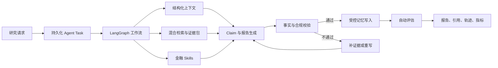
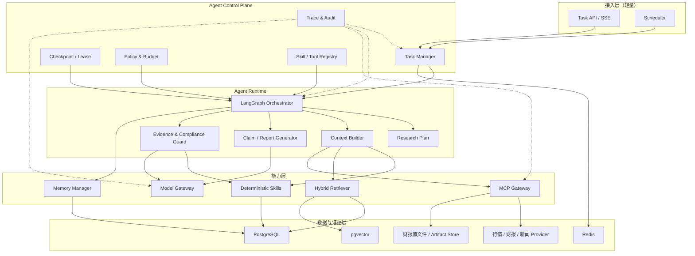
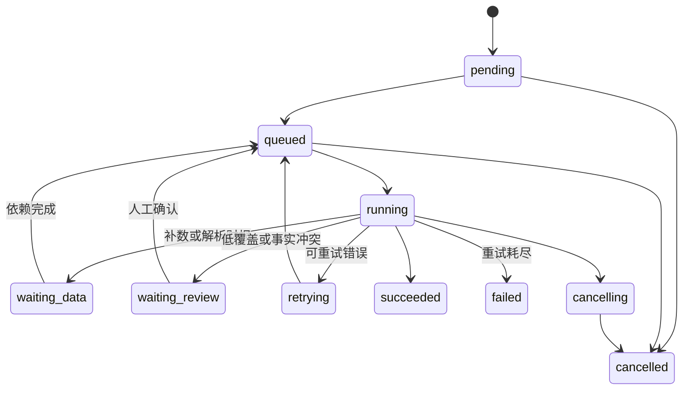
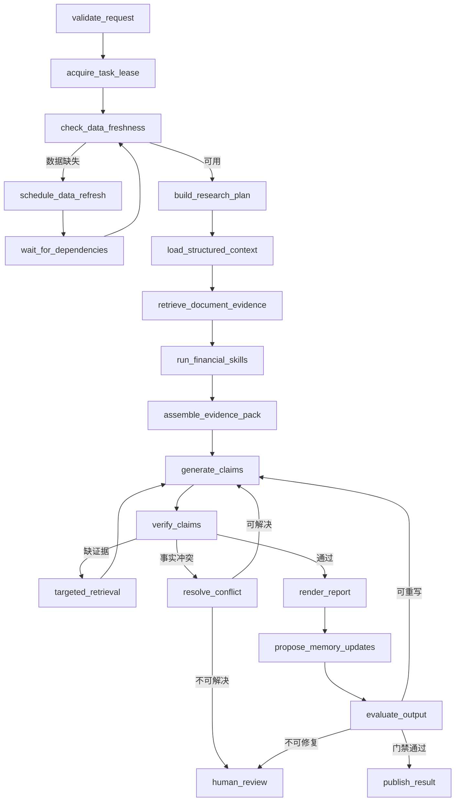
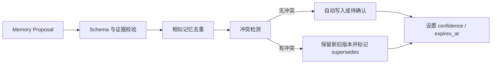
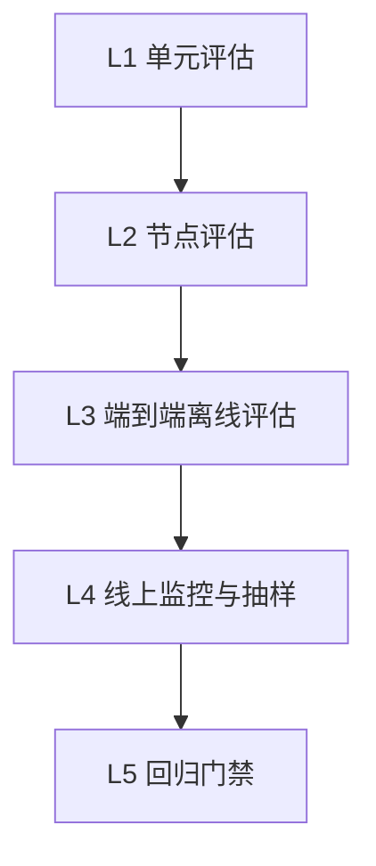

# A 股基本面研究 Agent 平台技术方案

> 版本：v1.0  
> 重点：Agent Runtime、任务编排、Skills、MCP、RAG、记忆、证据治理、评估与可观测性  
> 边界：仅做公开信息研究辅助，不执行交易，不输出买卖建议、目标价或收益承诺

## 1. 方案摘要

本系统不是“把股票代码交给大模型，再生成一段文字”的问答机器人，而是一套可追踪、可恢复、可验证、可评估的金融研究 Agent 工程系统。

系统以持久化任务为运行载体，以 LangGraph 为单次执行编排器，以 Skills 承载确定性金融分析，以 MCP 统一外部工具协议，以结构化 SQL 与混合 RAG 提供事实，以 Evidence Ledger 建立结论到来源的追溯链路，以分层长期记忆支持持续研究，以在线守卫和离线评测控制幻觉与合规风险。



目标状态：

- 每次研究都有 task、step、tool call、evidence、report、memory change 和 eval result。
- 任意关键数字和结论均可定位到结构化字段或原文片段。
- 节点失败后从安全检查点恢复，不重复执行已完成的副作用。
- 模型负责语义理解、综合推理和表达；财务计算、数据选择与合规检查尽量由确定性代码完成。
- 数据不足、过期或冲突时明确降级为“需复核”，而不是让模型补全事实。

## 2. 建设目标与边界

### 2.1 建设目标

1. 支持单家公司近五年、逐季度的基本面研究。
2. 自动整合行情、估值、三大报表、公告、新闻、Wiki 与历史结论。
3. 生成结构固定、证据充分、禁止投资建议的中文研究报告。
4. 支持异步执行、失败恢复、步骤追踪、取消、重试和人工复核。
5. 将金融分析方法沉淀为可复用、可测试、可版本化的 Skills。
6. 将行情、财报、新闻、知识库和记忆能力通过 MCP 标准化。
7. 建立评测体系，量化准确率、证据覆盖率、幻觉率与工具稳定性。

### 2.2 非功能目标

| 维度 | 目标 |
|---|---|
| 可解释性 | 每条关键结论关联 evidence_id，可查看原文、页码、日期和来源 |
| 可恢复性 | Worker 异常退出后从最近成功检查点继续 |
| 可替换性 | LLM、Embedding、Provider、向量库与 MCP 服务可替换 |
| 可测试性 | 节点、Skill、工具、检索、Prompt 和完整工作流均可测试或回放 |
| 可观测性 | 统一 trace_id、task_id、step_id，记录耗时、Token、错误和重试 |
| 安全合规 | 不输出买卖建议、目标价或收益承诺；敏感配置不进入模型上下文 |
| 演示稳定性 | 无外部密钥时可用 deterministic mock 跑通完整流程 |

### 2.3 明确不做

- 不连接券商或交易执行接口。
- 不将模型输出直接作为金融事实写入主数据表。
- 不以向量检索替代财务数据库的精确查询与计算。
- 不允许 Agent 自由执行任意 Python、Shell、SQL 或网络请求。
- 不将“多个角色提示词”包装成缺少独立状态和失败边界的伪多 Agent。

## 3. 现状与目标差距

项目当前已具备八节点 LangGraph、Celery 异步任务、任务/步骤/工具日志表、10 个 Skill 注册项、4 类 MCP Client、BM25 检索雏形、Agent Memory 与 Eval 表，并支持 OpenAI-compatible 模型。

当前实现主要用于演示闭环，距离生产级 Agent 仍有以下差距：

| 能力 | 当前状态 | 目标状态 |
|---|---|---|
| 工作流 | 固定八节点直线执行 | 条件分支、检查点、补数、重写、人工复核、恢复 |
| 状态 | TypedDict，结果直接传递 | 版本化 State Schema，大对象存引用，输入输出校验 |
| 数据 | 多处 deterministic mock | Provider 路由、数据契约、质量评分、来源与回退 |
| RAG | 内存示例文档、字符级 BM25 | SQL + BM25 + pgvector + rerank + 元数据过滤 |
| Skills | 统一 BuiltinSkill 分支 | 独立实现、清单、版本、Schema、测试 |
| MCP | 本地类模拟调用 | 标准 transport、能力发现、超时、熔断、权限和审计 |
| 引用 | 正文手工写“证据1” | 结构化 Claim 绑定 evidence_id 后统一渲染 |
| 校验 | 禁词扫描与固定分数 | 数值回查、语义校验、覆盖率、冲突检测、合规守卫 |
| 记忆 | 每次固定写一条结论 | 提议、去重、冲突、置信度衰减、过期与确认 |
| 评估 | 指标为固定示例值 | 数据集驱动、回放、版本对比和发布门禁 |
| 可观测性 | task/step/tool 基础日志 | Trace、模型成本、检索轨迹、Prompt/模型版本 |

后续建设重点不是继续堆页面或提示词，而是把现有演示链路升级为可靠的 Agent Runtime。

## 4. 总体架构



### 4.1 控制平面与执行平面

控制平面负责“任务是否应该运行、运行到哪里、能使用什么、预算是多少、失败如何恢复”；执行平面负责“当前节点做什么”。

- Task Manager：创建任务、分配 Worker、取消、超时和重试。
- Checkpoint Manager：保存节点前后状态，支持恢复和回放。
- Policy Engine：控制工具白名单、Token、耗时、循环次数与合规规则。
- Registry：管理 Skill、Tool、Prompt、Model 的版本与元数据。
- LangGraph Runtime：执行图和条件边，不承担长期任务调度。

## 5. Agent Runtime 设计

### 5.1 Agent 边界

| Agent | 作用 | 阶段 |
|---|---|---|
| FundamentalResearchAgent | 单家公司基本面研究主流程 | 首期 |
| ReportUpdateAgent | 财报发现、下载、解析、切块与质量检查 | 首期 |
| EvalAgent | 回放评测用例并归因失败 | 首期 |
| WeeklyMonitorAgent | 批量检测自选股变化并生成摘要 | 第二阶段 |
| SectorReasoningAgent | 新闻聚类和板块热点归因 | 第二阶段 |

只有当子任务具备独立状态、工具集、预算、失败边界和评估标准时才拆成独立 Agent。首期采用单编排器 + 多确定性 Skill，比多个模型互相讨论更稳定、便宜且易解释。

### 5.2 任务状态机



状态迁移通过 Task Manager 完成，并使用乐观锁或行锁防止两个 Worker 同时推进。`agent_task` 建议增加：

- `state_version`、`workflow_version`、`prompt_bundle_version`、`skill_set_version`、`model_profile`。
- `lease_owner`、`lease_expires_at`、`checkpoint_step`、`checkpoint_payload_ref`。
- `max_retries`、`next_retry_at`、`cancel_requested_at`。
- `trace_id`、`parent_task_id`、`dedup_key`。

### 5.3 基本面研究工作流



循环必须有硬限制，例如最多 2 次补检索和 1 次重写。

### 5.4 节点契约

```python
class NodeResult(BaseModel):
    status: Literal["success", "retry", "wait", "review", "failed"]
    state_patch: dict
    artifacts: list[ArtifactRef] = []
    metrics: dict[str, float] = {}
    warnings: list[WarningItem] = []
    next_hint: str | None = None
```

节点规则：

1. 输入、输出必须使用 Pydantic Schema 校验。
2. 节点不得隐式依赖全局变量，依赖通过上下文或 Registry 注入。
3. 大型财报文本不写入 State，只保存 artifact_id 或 evidence_pack_id。
4. 节点启动前写 running，结束时在同一事务写输出和 checkpoint。
5. 外部副作用必须带 idempotency_key。
6. 可重试异常与不可重试异常分型，禁止统一无脑重试。

### 5.5 轻状态模型

```python
class ResearchState(TypedDict, total=False):
    task_id: str
    trace_id: str
    workflow_version: str
    request: ResearchRequest
    plan: ResearchPlan
    dataset_snapshot_id: str
    context_ref: str
    evidence_pack_id: str
    skill_run_ids: list[str]
    claim_set_id: str
    report_id: str
    eval_run_id: str
    loop_count: dict[str, int]
    warnings: list[WarningItem]
    errors: list[ErrorItem]
```

数据快照、检索结果、模型原始响应和报告作为 Artifact 独立存储，避免 checkpoint 过大，并为回放评估提供稳定输入。

### 5.6 幂等、重试与恢复

- 创建任务：`dedup_key = task_type + ts_code + report_period + dataset_version + request_hash`。
- 数据写入：使用业务唯一键 upsert，不按执行次数新增记录。
- Tool Call：`idempotency_key = task_id + step + tool + normalized_args_hash`。
- 模型调用：网络错误、429、部分 5xx 可重试；内容校验失败走重写分支。
- 指数退避：2s、5s、15s 并加 jitter；单工具最多 3 次。
- Worker 恢复：租约过期的 running task 重新入队，从最后成功 checkpoint 继续。
- 非幂等消息发送使用 Transactional Outbox，避免数据库提交与消息投递不一致。

## 6. 计划、上下文与模型网关

### 6.1 模板化 Research Plan

基本面维度稳定，采用“模板计划 + 有限动态扩展”：

```json
{
  "dimensions": [
    "growth", "profitability", "cashflow_quality", "balance_sheet",
    "valuation", "business_segments", "peer_comparison", "risk",
    "investment_thesis"
  ],
  "periods": 20,
  "required_sources": ["structured_financial", "official_report"],
  "optional_sources": ["news", "wiki", "memory"]
}
```

模型可根据行业增加受控维度，例如银行的净息差与不良率、制造业的库存与产能，但只能从行业 Skill Catalog 选择，不能生成任意工具名。

### 6.2 Context Builder

上下文按以下优先级和 Token 预算装配：系统规则与输出 Schema；用户问题；结构化事实摘要；Skill 结果；高质量证据；已确认记忆；冲突、缺失和过期警告。

不直接把 20 个季度全部 JSON、所有检索片段和历史报告塞给模型。先由代码生成紧凑的 `ResearchContext`，每部分都有 Token 上限。

### 6.3 Model Gateway

在现有 OpenAI-compatible Client 外增加统一网关：

- 统一超时、重试、限流、Token、成本、缓存与脱敏。
- 支持 reasoning、generation、verification、embedding 四类 profile。
- Prompt、模型与参数版本化并写入 task。
- 优先结构化输出或 JSON Schema，Markdown 仅在最后渲染。
- 设置任务级最大调用次数、Token、费用、循环次数和总耗时。

| 场景 | 要求 | Temperature |
|---|---|---|
| Claim 生成 | 强结构化输出、中文综合能力 | 0.1–0.2 |
| 证据一致性 | 稳定分类 | 0 |
| 报告润色 | 表达能力较好 | 0.2–0.3 |
| 查询改写 | 小模型即可 | 0 |

## 7. Skills 体系

### 7.1 定位与目录

Skill 是可复用领域能力，不是一段提示词别名，也不应共享一个巨大 `if/elif` 执行器。

```text
skill-name/
├── Skill.md
├── manifest.yaml
├── input.schema.json
├── output.schema.json
├── skill.py
├── tests/
└── fixtures/
```

```yaml
name: cashflow_quality_analysis
version: 1.1.0
category: financial
deterministic: true
timeout_seconds: 5
required_permissions:
  - financial.read
input_schema: input.schema.json
output_schema: output.schema.json
evidence_policy: required
```

### 7.2 首批 Skills

| Skill | 核心输出 | 关键边界 |
|---|---|---|
| valuation_range_analysis | PE/PB 当前值、历史分位 | 处理负 PE、缺失值、复权与行业差异 |
| three_statement_analysis | 三表勾稽异常、趋势 | 跨表验证、单季/累计口径 |
| dupont_analysis | ROE 拆解及变化贡献 | 公式和输入版本可追溯 |
| cashflow_quality_analysis | OCF/净利润、FCF、回款质量 | 区分季节性与长期恶化 |
| business_segment_analysis | 收入结构、集中度、毛利贡献 | 业务口径变化告警 |
| peer_comparison_analysis | 同行分位与差异 | 同行业、同报告期、同口径 |
| risk_red_flags_analysis | 应收、存货、商誉、负债红旗 | 阈值行业化，输出证据和严重度 |
| investment_thesis_check | verified/weakened/invalidated | 只能依据已确认假设与新证据 |
| sector_heat_reasoning | 事件簇、热度驱动 | 区分事实、推断和市场表现 |
| evidence_coverage_check | Claim 级引用覆盖 | 关键数字必须 100% 可追溯 |

### 7.3 执行协议

```python
class SkillResult(BaseModel):
    skill_name: str
    skill_version: str
    status: Literal["success", "partial", "failed"]
    output: dict
    evidence_ids: list[str]
    warnings: list[WarningItem]
    quality_score: float
    execution_meta: ExecutionMeta
```

执行器负责 Schema 校验、权限、超时、日志、缓存和错误标准化；Skill 只负责领域逻辑。公式输出同时保留公式版本、输入字段、单位、报告期和结果。

首期按任务类型、行业和数据可用性规则选 Skill。后续可允许模型在 Registry 白名单中选择，最终仍由 Policy Engine 校验。

## 8. MCP 工具体系

### 8.1 能力边界

内部纯函数计算优先做 Skill；跨进程、跨语言、访问外部数据或独立维护的能力做 MCP Server：

- `market-data-mcp`：股票、行情、估值、市值、指数、交易日历。
- `financial-report-mcp`：财务报表、公告发现、下载、解析和表格抽取。
- `news-sector-mcp`：公司新闻、板块新闻、聚类与热度。
- `wiki-memory-mcp`：Wiki、股票记忆、投资假设读取与受控更新。

### 8.2 Tool Contract

每个工具声明名称、版本、输入输出 Schema、权限、幂等性、超时、新鲜度、成本等级和副作用。

```json
{
  "name": "get_valuation_history",
  "version": "1.0.0",
  "permissions": ["market.read"],
  "idempotent": true,
  "timeout_ms": 5000,
  "freshness": "T+1",
  "side_effect": "none"
}
```

标准响应包含 `ok`、`data`、`source.provider`、`source.fetched_at`、`source.as_of`、`quality.completeness`、`quality.warnings` 和 `request_id`。

### 8.3 MCP Gateway

Agent 通过 Gateway 而非直连 Server：

- 能力发现与 Schema 缓存。
- 独立超时、并发上限、限流和熔断。
- 输入白名单、输出大小限制、URL 与文件策略。
- 读写权限分离，默认只读。
- 统一错误：timeout、rate_limited、invalid_input、provider_error、permission_denied。
- 记录参数哈希、输出摘要、artifact_ref、耗时和重试。
- Provider 回退后保留真实来源，不能伪装成主 Provider。

### 8.4 Tool 安全

- 模型只看到允许的工具，不看到凭据和内部地址。
- 禁止任意 SQL、任意文件路径和任意 URL 工具。
- 财报和网页按不可信输入处理，防止其中的提示注入改变系统规则。
- 工具文本进入模型前限制长度、标记来源并剥离可疑控制指令。
- 所有写工具要求 task scope、资源所有权和审计原因。

## 9. 数据、RAG 与证据工程

### 9.1 三类知识通道

1. 结构化事实：行情、估值、财报和指标，走 SQL 与 Skill。
2. 文档事实：财报、公告、新闻和 Wiki，走解析与混合检索。
3. 研究记忆：偏好、假设、历史结论和跟踪指标，走 Memory Manager。

不能把三者全部混入向量库。财务数字以结构化数据库为事实源，原文用于解释和交叉验证。

### 9.2 财报摄取


- 以 document_hash 去重并保留版本。
- Chunk 按章节、表格和语义边界切分，保留页码、标题和表头。
- 数字记录原始值、标准值、单位、币种、累计/单季口径和页码。
- 抽取完整度低于阈值时不可用于关键结论。
- 文档采用 staging → validated → active，避免半解析内容进入检索。

### 9.3 混合检索

1. 查询理解：提取股票、报告期、研究维度和来源类型。
2. 先按股票、时间、文档类型与状态过滤。
3. BM25 与 pgvector 并行召回。
4. 用 Reciprocal Rank Fusion 融合，避免直接比较异构分数。
5. 对 Top-20 重排，保留 Top-6 至 Top-10。
6. 去重和多样性控制，避免单一章节占满上下文。
7. 对过期、低完整度、无来源内容降权。

```text
final_score = 0.45 * rrf_score
            + 0.20 * rerank_score
            + 0.15 * source_authority
            + 0.10 * freshness_score
            + 0.10 * extraction_quality
```

### 9.4 Evidence Ledger

报告前建立不可变 Evidence Pack。文档证据保存 evidence_id、source_id/url、document_hash、标题、章节、页码、quote、as_of、retrieval_score 和 quality_score。结构化证据保存表、业务键、字段、值、单位、source 和 fetched_at。

Evidence Pack 不原地修改；补检索创建新版本。这样报告可以稳定回放和审计。

### 9.5 Claim-first 生成

模型先输出结构化 Claim，而不是直接写最终 Markdown：

```json
{
  "claim_id": "C-001",
  "section": "cashflow_quality",
  "statement": "最近报告期经营现金流与归母净利润匹配度改善",
  "claim_type": "analytical",
  "evidence_ids": ["E-SQL-011", "E-SQL-012"],
  "confidence": 0.86,
  "limitations": ["单季度波动较大"]
}
```

事实校验后由 Renderer 将 Claim、表格、引用和免责声明渲染为 Markdown，降低“有引用编号但不支持结论”的伪引用风险。

## 10. 证据校验与安全守卫

### 10.1 校验流水线

1. Schema：章节、Claim 字段与引用格式完整。
2. 数值回查：金额、比例、报告期可在结构化 Evidence 找到。
3. 引用覆盖：事实 Claim 至少一个 Evidence，关键数字 100% 覆盖。
4. 语义支持：Claim 被支持、部分支持或矛盾。
5. 时效：数据满足 freshness policy。
6. 冲突：多 Provider、SQL 与财报原文差异检测。
7. 合规：买卖建议、目标价、收益承诺、绝对化表达与免责声明。
8. 身份：股票代码、公司名和报告期未串用。

### 10.2 发布门禁

| 条件 | 处理 |
|---|---|
| 关键数字无引用 | 阻止发布，补检索或重写 |
| Citation coverage < 90% | 标记需复核 |
| Evidence 直接矛盾 | 进入冲突处理节点 |
| 关键数据过期 | 触发更新；失败则显著提示 |
| 出现买卖建议或目标价 | 阻止发布并重写 |
| 仅使用 mock 数据 | 可演示，但必须全局标记 mock |
| 模型失败 | 保留 Skill 结果，输出结构化降级报告或失败 |

文档内容只是数据，不是指令。工具权限由服务端决定，模型不得根据检索文本增加工具权限或修改系统规则。

## 11. 长期记忆设计

### 11.1 记忆分层

| 类型 | 示例 | 写入策略 |
|---|---|---|
| user_preference | 关注现金流，不展示交易建议 | 用户明确表达后写入 |
| investment_thesis | 核心产品量价稳定是长期假设 | 用户确认或已有假设更新 |
| historical_conclusion | 2025Q4 毛利率改善 | Agent 提议，经校验后写入 |
| watch_indicator | 跟踪合同负债与经销商库存 | Agent 提议，可人工编辑 |
| risk_note | 商誉减值风险上升 | 需要高置信度证据 |
| system_rule | 不输出目标价 | 只由管理员配置，Agent 不可改写 |

### 11.2 受控写入



模型不能直接更新 `system_rule`。`historical_conclusion` 和 `risk_note` 必须关联 evidence_ids、报告期、数据截止日期与生成任务。记忆不是永真事实，应支持：

- `valid_from`、`valid_to`、`expires_at`。
- `supersedes_memory_id` 和版本链。
- 置信度随时间衰减。
- 新财报发布后触发相关记忆复核。
- 检索时优先 active、未过期、已确认且与当前报告期相关的记忆。

## 12. 评估体系

### 12.1 分层评估



- L1：公式、数据清洗、Skill、Tool Adapter。
- L2：检索、上下文构建、Claim 生成和证据校验。
- L3：固定数据快照下执行完整任务。
- L4：工具失败、Token、延迟、引用缺失和人工驳回率。
- L5：模型、Prompt、Skill 或检索升级前进行基线对比。

### 12.2 核心指标

| 指标 | 计算方式 | 稳定版目标 |
|---|---|---|
| data_accuracy | 可回查数字中与事实源一致的比例 | ≥ 99% |
| citation_coverage | 有有效证据的事实 Claim / 全部事实 Claim | ≥ 95% |
| key_number_coverage | 有结构化证据的关键数字 / 全部关键数字 | 100% |
| retrieval_hit_rate@k | Gold Evidence 是否进入 Top-K | ≥ 90% |
| faithfulness | Claim 被引用证据支持的比例 | ≥ 95% |
| hallucination_rate | 无来源或与来源矛盾的 Claim 比例 | ≤ 2% |
| tool_success_rate | 成功 Tool Call / 全部 Tool Call | ≥ 98% |
| task_recovery_rate | 可恢复故障中成功恢复的比例 | ≥ 95% |
| completeness | 必需研究维度覆盖率 | ≥ 95% |
| compliance_pass_rate | 无禁用内容且有免责声明的比例 | 100% |

固定写死的演示分数不能计入真实评估。每项指标必须保存 evaluator 版本、输入快照、逐项明细与失败原因。

### 12.3 Eval Case

用例至少覆盖：

- 正常公司、亏损公司、金融行业和高成长制造业。
- 负 PE、缺财报、季度口径混合、单位变化和数据冲突。
- 查询要求超过数据范围。
- 财报中包含提示注入文本。
- MCP 超时、429、部分返回和错误股票代码。
- 模型输出目标价、无来源数字或错误报告期。
- Worker 中断后的恢复与重复消息投递。

Gold 数据采用冻结数据快照和人工标注 Evidence，确保模型或真实数据源变化时仍可复现。

### 12.4 版本门禁

每次评测记录代码提交、workflow、prompt bundle、model、embedding、retriever、skill set 与 dataset 版本。新版本只有在关键指标不退化、合规率 100%、成本与 P95 延迟处于预算内时才能成为默认版本。

## 13. 可观测性与审计

### 13.1 Trace 模型

```text
trace_id
└── task_id
    ├── step_id
    │   ├── tool_call_id
    │   ├── model_call_id
    │   └── retrieval_run_id
    └── artifact_id / evidence_pack_id / report_id / eval_run_id
```

建议接入 OpenTelemetry，日志使用 JSON。现有 `tool_call_log` 扩展：

- tool/version、attempt、idempotency_key。
- input_hash、output_hash、artifact_ref。
- provider、status_code、error_type。
- latency_ms、queue_time_ms。
- input_tokens、output_tokens、estimated_cost。
- cache_hit、retry_count、trace_id。

### 13.2 监控项

- 队列积压、任务成功率、各节点 P50/P95/P99。
- MCP/Provider 成功率、限流率和熔断状态。
- 模型错误率、Token、费用、结构化输出失败率。
- RAG 无结果率、Top-K 命中率、平均 Evidence 质量。
- 引用覆盖、事实冲突、合规阻断和人工复核率。
- Checkpoint 恢复次数、僵尸任务和重复执行数。

日志禁止保存 API Key、数据库凭据、完整隐私数据和未经裁剪的财报全文。模型原始请求可加密保存到受限 Artifact Store，并设置保留期限。

## 14. 数据模型扩展

在现有表基础上增加：

| 表 | 作用 |
|---|---|
| agent_checkpoint | 节点级持久化状态和恢复信息 |
| agent_artifact | 数据快照、模型响应、检索结果等大对象引用 |
| model_call_log | Prompt/模型版本、Token、费用、响应与错误 |
| retrieval_run | 查询、过滤器、召回、融合和 rerank 轨迹 |
| evidence_item | 统一结构化数据与文档证据 |
| evidence_pack | 一次报告使用的不可变证据集合 |
| claim | 报告中的结构化结论及验证状态 |
| claim_evidence | Claim 与 Evidence 多对多关联 |
| memory_proposal | 记忆写入前的提议和审核状态 |
| eval_run / eval_item | 一次评测与逐项评分明细 |
| workflow_definition | 工作流名称、版本、图哈希和状态 |
| prompt_template | Prompt 名称、版本、内容哈希和状态 |

重要约束：

- `agent_step(task_id, step_name, attempt)` 唯一。
- `tool_call_log(idempotency_key)` 在非空时唯一。
- `evidence_item` 保存 source identity、as_of、quality 与 content hash。
- `claim_evidence(claim_id, evidence_id)` 唯一。
- 报告关联 dataset_snapshot_id、evidence_pack_id 和全部运行版本。

## 15. Agent API

前端不是重点，但 Agent API 必须稳定并反映真实运行模型。

### 15.1 创建任务

```http
POST /api/v1/agent/tasks
Idempotency-Key: <uuid>

{
  "task_type": "fundamental_research",
  "subject": {"type": "stock", "ts_code": "600519.SH"},
  "scope": {"periods": 20, "report_period": null},
  "question": null,
  "options": {
    "allow_data_refresh": true,
    "require_human_review": false,
    "model_profile": "balanced"
  }
}
```

返回 HTTP 202 和 task_id，不在 API 请求内同步运行 Agent。

### 15.2 查询与控制

```text
GET  /api/v1/agent/tasks/{task_id}
GET  /api/v1/agent/tasks/{task_id}/steps
GET  /api/v1/agent/tasks/{task_id}/events
GET  /api/v1/agent/tasks/{task_id}/tool-calls
GET  /api/v1/agent/tasks/{task_id}/evidence
GET  /api/v1/agent/tasks/{task_id}/report
GET  /api/v1/agent/tasks/{task_id}/eval
POST /api/v1/agent/tasks/{task_id}/cancel
POST /api/v1/agent/tasks/{task_id}/retry
POST /api/v1/agent/tasks/{task_id}/review
```

SSE 事件包含单调递增 `event_id`，通过 `Last-Event-ID` 断线续传。事件先写数据库 outbox，再推送，避免状态已提交但事件丢失。

## 16. 异步执行与部署

### 16.1 队列划分

| 队列 | 工作负载 | 并发建议 |
|---|---|---|
| agent_queue | 工作流推进和短节点 | 中等 |
| llm_queue | 模型调用，受外部限流影响 | 按模型配额 |
| data_update_queue | 行情、财务同步 | 较高 I/O 并发 |
| report_queue | PDF、OCR、解析、Embedding | 独立资源池 |
| eval_queue | 批量回放评测 | 低优先级 |

当前可继续使用 Celery + Redis。LangGraph 不应在单个 Celery 任务内长时间等待外部依赖；遇到补数、人工审核或长退避时保存 checkpoint 并释放 Worker，条件满足后重新入队。

### 16.2 Docker-first

开发、测试、迁移、评测和构建均在 Docker 内执行。Compose 增加独立 `agent-worker`、`report-worker`、`eval-worker`，并为每类 Worker 设置资源限制与健康检查。Provider 密钥通过 Secret 注入，不写入镜像。

### 16.3 缓存

- 市场与财务工具按 provider + args + as_of 缓存。
- Embedding 按 content_hash + model_version 缓存。
- 检索按 query + filter + index_version 做短 TTL 缓存。
- Skill 按 input_hash + skill_version 缓存。
- 模型缓存默认仅用于评测或完全相同上下文，不跨数据版本复用。

## 17. 安全、权限与合规

1. 工具最小权限，读写分离；默认 Agent 只有研究数据读取权限。
2. 用户输入、工具参数和模型输出均做 Schema 校验。
3. 外部 URL 使用 allowlist，防止 SSRF；文件路径限制在受控存储。
4. API Key、Token 和数据库凭据只存在 Secret，日志统一脱敏。
5. Tool 输出与财报内容视为不可信数据，防止 Prompt Injection。
6. 报告统一加免责声明，禁止买卖建议、目标价和收益承诺。
7. 模型不直接写主数据；Memory/Wiki 写入需受控工具、审计和版本化。
8. 审计记录不可被普通用户修改，关键 Artifact 保存内容哈希。
9. 用户删除任务时按保留策略清理请求、模型上下文和衍生 Artifact。

## 18. 性能与成本预算

| 项目 | MVP 目标 | 稳定版目标 |
|---|---:|---:|
| 端到端 P50 | ≤ 60 秒 | ≤ 40 秒 |
| 端到端 P95 | ≤ 180 秒 | ≤ 120 秒 |
| LLM 调用次数 | ≤ 4 | ≤ 3 |
| 补检索循环 | ≤ 2 | ≤ 1 |
| 上下文 Token | ≤ 30k | ≤ 20k |
| 工具调用成功率 | ≥ 95% | ≥ 98% |

降本优先减少无关上下文与重复模型调用，再考虑模型降级；不要为了省 Token 删除 Evidence。确定性 Skill 与 Renderer 应替代可代码化的模型工作。

## 19. 测试策略

### 19.1 单元测试

- 财务公式、异常值、缺失值、负数和单位转换。
- Skill Schema、超时与部分成功。
- Provider/MCP 错误映射和回退。
- Claim 数字回查、禁用表达与引用覆盖。
- Memory 去重、冲突、过期和权限。

### 19.2 集成测试

- PostgreSQL + Redis + Celery + Worker 完整链路。
- checkpoint 后杀死 Worker，再验证恢复。
- 重复投递同一任务，验证幂等性。
- MCP 超时、熔断和 Provider 回退。
- 财报从下载到可检索状态的流水线。
- SSE 断线重连与事件顺序。

### 19.3 Agent 回放

冻结 Tool 响应和 Evidence Pack，回放 Claim 生成与验证。模型升级时新旧版本并跑，比较准确率、引用、合规、成本和延迟。失败用例必须归因到数据、检索、Skill、模型、校验或运行时中的一个责任域。

## 20. 实施路线

### Phase 0：基线冻结（1 周）

- 固化当前 mock 链路和 Docker 测试。
- 为八节点、10 个 Skills 和 4 个 MCP Client 建立行为基线。
- 去除固定评估分数，明确仍为 mock 的接口。

验收：现有功能无回归，端到端结果可重复。

### Phase 1：可靠 Agent Runtime（2–3 周）

- 任务状态机、租约、checkpoint、幂等、错误分类和取消。
- 节点 Schema 与 Artifact Store。
- 模型、检索和 Tool Call 统一日志。
- SSE 事件持久化与断线续传。

验收：随机杀 Worker 后任务可恢复；重复请求不产生重复报告。

### Phase 2：Skills 与 MCP 工程化（2 周）

- 独立 Skill 与 manifest，补公式单测。
- MCP Gateway、发现、Schema、超时、熔断和权限。
- Provider 数据契约、来源和质量评分。

验收：每个 Skill 与 Tool 均有版本、契约、日志和失败用例。

### Phase 3：RAG 与 Evidence Ledger（3 周）

- 财报解析、语义切块、BM25 + pgvector + RRF + rerank。
- Evidence Item/Pack、Claim-first、数字回查与引用渲染。
- 时效、冲突和抽取质量门禁。

验收：关键数字引用覆盖 100%，Claim 可逐条回查。

### Phase 4：记忆与持续研究（2 周）

- Memory Proposal、去重、冲突、版本链、过期和复核。
- 投资假设与新季度证据自动对比。
- 周报 Agent 复用 Evidence 与 Skill 体系。

验收：旧结论不覆盖新事实，记忆更新有证据和审计。

### Phase 5：评估与发布门禁（持续）

- 冻结数据集和 Gold Evidence。
- 节点级、端到端和故障恢复评测。
- Prompt/模型/检索/Skill 版本对比和 CI 门禁。

验收：每次核心变更有可比较评测报告，合规通过率 100%。

## 21. 首期开发优先级

### P0

1. 去除固定评分和伪造延迟，指标来自真实运行。
2. 将节点拆出 `graph.py`，建立输入输出 Schema。
3. 建立 checkpoint、任务租约、幂等和错误分类。
4. Skills 从统一分支改为独立实现并补测试。
5. 建立 Evidence Item/Pack 与 Claim-first 报告生成。
6. 对关键数字做 SQL 回查，对禁用内容做发布阻断。
7. 为模型调用增加版本、Token、耗时、错误和成本日志。

### P1

1. 真实混合检索、metadata filter、RRF 与 rerank。
2. MCP Gateway 与 Tool 权限策略。
3. Memory Proposal 和冲突管理。
4. 冻结数据集、回放评测与 CI 门禁。

### P2

1. 行业专用 Skill Catalog。
2. 多 Provider 一致性校验。
3. 周报、板块归因等更多 Agent。
4. 仅在数据规模证明需要时引入 Qdrant 或更强 reranker。

## 22. 最终验收标准

- 任意报告可查看完整 task、step、tool、model、retrieval 和 eval 轨迹。
- 任意关键数字可定位到数据库记录或财报原文页码。
- Worker 在任意节点退出后可从 checkpoint 恢复。
- 同一幂等请求不会重复写报告、记忆或工具副作用。
- 数据缺失、过期、冲突和 mock 状态在报告中明确显示。
- 关键数字引用覆盖率 100%，事实 Claim 引用覆盖率不低于 95%。
- 买卖建议、目标价和收益承诺无法通过发布门禁，免责声明覆盖率 100%。
- Skill、Tool、Prompt、Model、Workflow 和数据快照均有版本。
- 评测来自真实执行，可回放、可比较、可定位失败责任域。
- 构建、测试和运行均可在 Docker 环境内完成。

## 23. 方案亮点

本方案最值得展示的不是“用了多少 AI 框架”，而是把不稳定的大模型能力放进了可控制的软件工程边界：

1. LangGraph 负责单次编排，数据库任务系统负责长期状态与恢复。
2. Skill 负责确定性金融计算，模型负责综合推理与表达。
3. MCP 负责标准化外部能力，Gateway 负责权限、稳定性与审计。
4. SQL 负责精确事实，RAG 负责文档证据，Memory 负责跨任务连续性。
5. Claim-first 与 Evidence Ledger 让报告从“看起来有依据”升级为“逐条可验证”。
6. 评测、版本和可观测性让 Agent 从 Demo 变成可持续迭代的工程系统。

最终产品应被定义为“有证据链的 A 股基本面研究工作流”，而不是“会写股票分析的大模型聊天框”。
